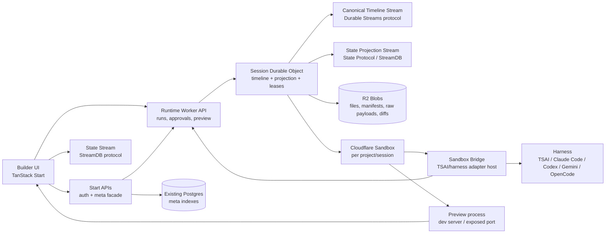
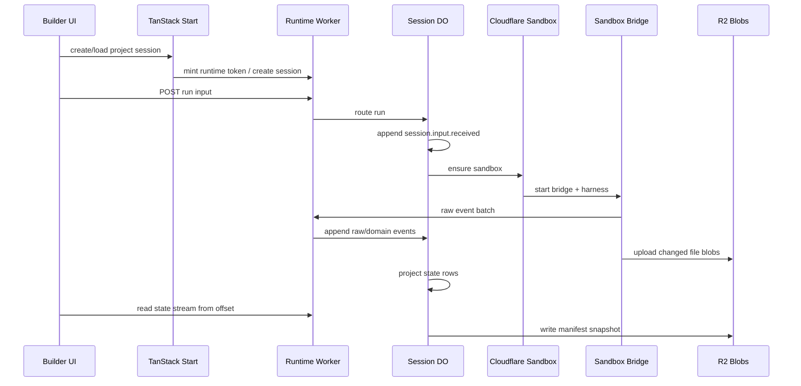
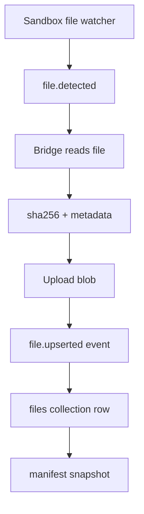

# Proposal: Agent Loop Builder Harness for tanstack.com

## Goal

Build a durable agent loop harness for the tanstack.com builder that can power a Lovable-style chat, preview, diff, and export experience without making the sandbox filesystem or a single chat stream the source of truth.

The core product loop:

1. User sends an instruction.
2. Runtime starts or resumes an isolated sandbox.
3. A harness adapter runs an agent loop against the project workspace.
4. Raw harness events are normalized into canonical builder events.
5. Canonical events update durable streams, materialized UI state, manifest blobs, preview state, and export artifacts.
6. The UI can reconnect, replay, approve, export, or resume from durable state. Branches are explicitly post-v1.

## Current Local Baseline

The existing builder is a local, non-durable configurator:

- `src/components/builder/store.ts` owns local config state.
- `src/components/builder/BuilderWorkspace.tsx` renders the current app starter/config UI.
- `src/routes/builder.index.tsx` is client-only and share-link oriented.
- `src/builder/api/compile.ts` compiles the selected config in memory.
- `/api/builder/download` and `/api/builder/deploy/github` export the current config result.
- WebContainer headers/dependency exist, but there is no active WebContainer runtime path yet.

This proposal adds a separate durable runtime instead of mutating the current builder into an agent platform in one step. V1 should launch on an unlisted, login-required `/forge` route; the existing `/builder` route stays intact and can seed durable manifests later.

## Strong Defaults

- Runtime/control plane: Cloudflare Worker plus Durable Objects.
- Durable execution state: Durable Streams-compatible event streams plus DO SQLite for local indexes/checkpoints.
- Meta DB: existing Postgres for global project/session/run indexes only.
- File/source record: immutable timeline events plus content-addressed blobs and manifest snapshots.
- UI state: StreamDB/TanStack DB projection from canonical events.
- AG-UI role: public run/chat wire and replayable raw event format, not the builder database.
- First harness: TanStack AI Sandbox from TanStack/ai#774.
- Executor: sandbox-resident bridge process that talks to the Worker/DO.
- Source control v1: export projection, not canonical source.
- WebContainer v1: optional client preview later, not canonical execution.
- Route v1: unlisted `/forge`, login required.
- Branching v1: no branch UI or branch execution; keep schema anchors only.
- Browser state v1: TanStack DB collections from the projected state stream.
- Runtime base: raw Durable Object, not Cloudflare Agents SDK.
- Blob storage: R2 content-addressed objects referenced from DO/Postgres metadata.
- Contract style: shared Standard Schema-compatible contracts with inferred TypeScript types.

This document uses `TSAI` as shorthand for TanStack AI Sandbox.

## Official Runtime Direction

Forge should build on top of the TanStack AI Sandbox work from TanStack/ai#774.
That is the official harness/runtime substrate going forward.

The current local `/forge` implementation is a PoC adapter path. Its job is to
prove the product loop:

- canonical timeline events
- manifest/blob source of truth
- event normalization
- Codex-like transcript UI
- preview projection
- export from manifest

It should not become a second production sandbox abstraction.

Ownership split:

| Layer              | Owner                                        |
| ------------------ | -------------------------------------------- |
| Sandbox contracts  | TanStack AI Sandbox                          |
| Provider runtimes  | TanStack AI Sandbox providers                |
| Harness adapters   | TanStack AI Sandbox adapter boundary         |
| Runtime bridge     | Forge bridge wrapping the TSAI sandbox layer |
| Canonical timeline | Forge runtime                                |
| Manifests/blobs    | Forge runtime                                |
| Event projection   | Forge runtime                                |
| Chat/builder UI    | Forge UI                                     |
| Preview/export UX  | Forge UI/runtime                             |

Practical rule: when Cloudflare sandbox execution lands, wire Forge through the
TSAI Sandbox bridge instead of building a parallel Cloudflare-only sandbox layer.
Local Codex CLI, local TanStack AI, or WebContainer code may exist only as
development/proof adapters behind the same Forge timeline/manifest contract.

## Non-Negotiable Invariants

1. The sandbox filesystem is never the source of truth.
2. The current UI state is always rebuildable from canonical events and blobs.
3. The state stream is disposable and rebuildable.
4. Raw harness events are evidence, not trusted domain state.
5. Every file in an export must come from a manifest snapshot.
6. Every side effect that may repeat after resume must be idempotent or guarded by an approval/event id.
7. A closed or failed run must still produce enough events to explain what happened.
8. A branch must have a manifest anchor, not only a stream offset.
9. The bridge must be replaceable without changing project history.
10. Postgres must not become the high-volume event log.

## Decision Matrix

| Decision          | Recommendation                  | Why                                                                          |
| ----------------- | ------------------------------- | ---------------------------------------------------------------------------- |
| Canonical storage | Timeline stream + blobs         | Rebuildable, inspectable, branchable                                         |
| UI storage        | StreamDB/TanStack DB projection | Reactive app state without trusting UI-only events                           |
| Runtime owner     | Worker/Session DO               | Exact stream/projection control                                              |
| Harness location  | Inside sandbox bridge           | Node/CLI/ACP compatibility and safer process isolation                       |
| First harness     | TanStack AI Sandbox             | Closest to local ecosystem and already AG-UI-shaped                          |
| Branching v1      | Defer                           | Preserve parent/manifest/offset fields, but ship no branch UI/behavior in v1 |
| WebContainer v1   | Optional preview only           | Browser constraints and no trusted server secrets                            |
| Source control v1 | Export projection               | Git is output, not project database                                          |

## Architecture Map



## Authority Table

| Data                                   | Authority                                 | Notes                                                  |
| -------------------------------------- | ----------------------------------------- | ------------------------------------------------------ |
| Project/session membership and indexes | Postgres                                  | Query/index/auth surface only                          |
| Run lifecycle                          | Canonical timeline                        | Projected to `runs` collection and indexed in Postgres |
| Chat transcript                        | Canonical timeline                        | Projected to `messages` and `messageParts`             |
| AG-UI stream                           | Runtime wire protocol                     | Persist raw for replay/debug; normalize before state   |
| File contents                          | R2 blobs referenced by timeline/manifests | Sandbox copy is disposable                             |
| Current file tree                      | Latest manifest plus file events          | Projected to `files` collection                        |
| Preview status                         | Runtime events                            | URL may rotate on sandbox restart                      |
| Approvals                              | Canonical timeline                        | AG-UI/harness prompts map into approval rows           |
| Exports/deploys                        | Runtime workflow events                   | External side effects require policy/approval          |
| Sandbox process state                  | Sandbox/bridge                            | Never the durable source of truth                      |

### Current Local PoC Data Boundary

The local `/forge` PoC now mirrors the intended production ownership model with local substitutes:

| Concern                         | Local PoC owner                                      | Production owner                                        |
| ------------------------------- | ---------------------------------------------------- | ------------------------------------------------------- |
| Project/chat sidebar metadata   | Neon `forge_projects` / `forge_chat_sessions`        | Postgres builder project/session indexes                |
| Chat transcript and run state   | Local runtime timeline plus projected state files    | Session DO timeline plus projected state stream         |
| File contents and manifests     | Local content-addressed manifest/blob store          | R2 blobs plus immutable manifest timeline events        |
| Browser sidebar query           | TanStack DB query collection over meta server facade | TanStack DB query collection over Start/Postgres facade |
| Browser transcript/files/events | TanStack DB local projection from SSE state batches  | TanStack DB projection from Durable Streams state rows  |

Neon is intentionally limited to shell metadata and pointers:

- project id, owner, name, active chat id
- chat id, title, timestamps, archive status
- runtime session id pointer
- latest manifest/run pointer and status for discovery

Neon must not store messages, message parts, workflow events, agent events, file payloads, manifest JSON, stream rows, raw AG-UI events, or sandbox state. Those remain derived from the runtime state stream and rebuildable from canonical timeline/blob storage.

## Service Boundaries

### TanStack Start Site

Owns:

- User auth.
- Project/session CRUD facade.
- Existing Postgres connection.
- UI route loading and permission checks.
- Signed runtime tokens for Worker calls.

Does not own:

- Durable run event append.
- Sandbox process control.
- Stream fanout.
- Harness normalization.

### Runtime Worker

Owns:

- Authenticated runtime endpoints.
- Session Durable Object routing.
- Durable Streams-compatible read/write endpoints.
- Sandbox lifecycle orchestration.
- Bridge lease issuance.
- Approval resume endpoints.
- R2 blob access.

Important: the Worker can expose Durable Streams-compatible endpoints while still using an internal DO implementation. Protocol compatibility matters more than matching a specific hosted backend in v1.

### Session Durable Object

One active DO per project session.

Owns:

- Timeline append order.
- Producer fencing/idempotency.
- Raw event normalization.
- State projection.
- Projector checkpoints.
- Connected readers.
- Sandbox lease state.
- Current manifest pointer.

The DO can use Cloudflare Agents primitives if they do not obscure the stream protocol, but the default should be a raw DO. The runtime needs exact control over offsets, producer epochs, stream forks, and state reset events.

Use SQLite-backed Durable Object storage for new namespaces. In-memory state can cache hot pointers, but producer state, stream offsets, projector checkpoints, bridge leases, and manifest pointers must be durable.

Suggested DO tables/kv namespaces:

```text
timeline_events(offset, event_id, event_json, created_at)
state_events(offset, txid, event_json, created_at)
raw_events(offset, raw_event_id, raw_kind, inline_json, blob_ref, created_at)
producers(producer_id, epoch, next_seq, updated_at)
projector_checkpoints(name, timeline_offset, state_offset, updated_at)
bridge_leases(lease_id, epoch, status, last_heartbeat_at, expires_at)
session_pointers(current_manifest_version_id, current_run_id, updated_at)
locks(name, holder_id, expires_at, updated_at)
```

Required constraints:

- `timeline_events.offset` and `state_events.offset` are monotonically increasing per session.
- `timeline_events.event_id` is unique.
- `raw_events.raw_event_id` is unique per producer epoch.
- `producers(producer_id)` stores the only accepted next sequence for that producer.
- `bridge_leases(lease_id)` stores the accepted epoch and rejects stale bridge writes.
- `locks(name)` is unique while active.
- `projector_checkpoints(name)` records both timeline and state offsets so projection can resume without re-emitting rows.

The exact physical layout can change, but these logical records and constraints must survive DO restarts.

### Sandbox Bridge

Runs inside the Cloudflare Sandbox. This is deliberate.

Owns:

- Starting the chosen harness adapter.
- Handling adapter-specific IO, including PTY/WebSocket or ACP.
- Watching files.
- Reading changed files and uploading blobs through signed Worker endpoints.
- Emitting raw harness events with a stable producer sequence.
- Receiving approval decisions/resume payloads.

The Worker should not directly host Node-only harness code or MCP bridge code. Cloudflare Sandbox command `stdin` is startup input, not a normal long-lived writable process handle. ACP and interactive CLIs should use a sandbox bridge, PTY WebSocket, or adapter-owned HTTP/WebSocket server.

### Sequence Flow



### Long-Running Execution

- `POST /runs` creates or queues a run and returns a `runId`; it should not require the browser request to stay open for the whole harness run.
- UI observes progress through the state stream and optional AG-UI-compatible event stream.
- Approvals can close the current stream and resume through a later request.
- The Session DO and sandbox bridge own continuation, heartbeats, and recovery.
- Headless/background workflows should drain or project events the same way a connected UI would.

### Run Lifecycle

```text
queued
  -> starting
  -> running
  -> paused
  -> running
  -> finishing
  -> finished
```

Terminal alternatives:

```text
queued|starting|running|paused -> failed
queued|starting|running|paused -> cancelled
running -> interrupted
```

Rules:

- `paused` means waiting for approval or user input and may resume.
- `interrupted` means the current run cannot continue in-process; start a new run with resume context if supported.
- `finished` only means the harness run ended; file/manifest/export workflows may still continue as separate system activities.
- A run cannot emit file or approval state after `finished` unless the event is marked as late evidence and handled by reconciliation.

### Concurrency Model

V1 default:

- One active harness run per session.
- Multiple sessions can run independently. Branch sessions are post-v1.
- Preview can stay active while a run is active.
- Export/deploy workflows acquire a manifest/version lock and should not read live sandbox files.
- Manifest snapshot creation should serialize per session.
- Validation commands can run during a harness run only if the harness adapter marks the workspace as quiescent or the command is read-only.

### Concurrency Locks

Represent locks in Session DO storage, not only in memory.

```typescript
type BuilderSessionLock = {
  id: string
  sessionId: string
  kind:
    | 'harness-run'
    | 'manifest-snapshot'
    | 'export'
    | 'deploy'
    | 'workspace-validation'
  ownerId: string
  ownerKind: 'run' | 'workflow' | 'system'
  status: 'active' | 'released' | 'expired'
  acquiredAt: string
  expiresAt: string
  releasedAt?: string
}
```

Rules:

- `harness-run` is exclusive per session in v1.
- `manifest-snapshot` serializes file projection into immutable manifests.
- `export` and `deploy` lock a specific manifest version, not the live workspace.
- `workspace-validation` may overlap with a run only when declared read-only.
- Expired locks append a system activity before another owner takes over.

## Event and Stream Model

### Stream Layout

Use at least two streams per session:

```text
/builder/projects/{projectId}/sessions/{sessionId}/timeline
/builder/projects/{projectId}/sessions/{sessionId}/state
```

Optional debug/raw stream:

```text
/builder/projects/{projectId}/sessions/{sessionId}/raw/{runId}
```

Encoding:

- Timeline stream: newline-delimited JSON `BuilderTimelineEvent` records, `application/x-ndjson`.
- State stream: newline-delimited State Protocol JSON records, `application/x-ndjson`.
- Raw stream: newline-delimited raw refs or compact inline raw records, `application/x-ndjson`.
- Blob payloads live in R2; streams carry refs for large data.

### Why Two Streams

The timeline is canonical and domain-oriented. It records what happened.

The state stream is derived and UI-oriented. It records what should be materialized into TanStack DB collections.

This keeps AG-UI, harness events, raw logs, file diffs, and UI rows from collapsing into one overloaded stream shape.

### Canonical Event Envelope

```typescript
type BuilderTimelineEvent = {
  schemaVersion: 1
  eventId: string
  projectId: string
  sessionId: string
  threadId?: string
  runId?: string
  parentEventId?: string
  producer: {
    id: string
    kind: 'ui' | 'agent' | 'bridge' | 'normalizer' | 'projector' | 'system'
    epoch: string
    seq: number
  }
  type: BuilderEventType
  payload: unknown
  raw?: {
    kind: 'ag-ui' | 'tanstack-ai' | 'harness' | 'sandbox' | 'process'
    inline?: unknown
    blobRef?: string
  }
  blobRefs?: string[]
  createdAt: string
}
```

### Event Type Families

```typescript
type BuilderEventType =
  | 'session.input.received'
  | 'session.forked'
  | 'session.policy.updated'
  | 'session.compacted'
  | 'session.branch.summary'
  | 'run.queued'
  | 'run.started'
  | 'run.paused'
  | 'run.resumed'
  | 'run.finished'
  | 'run.failed'
  | 'run.interrupted'
  | 'run.cancelled'
  | 'message.started'
  | 'message.content'
  | 'message.ended'
  | 'message.snapshot'
  | 'message.cancelled'
  | 'reasoning.started'
  | 'reasoning.content'
  | 'reasoning.ended'
  | 'tool.started'
  | 'tool.args'
  | 'tool.ended'
  | 'tool.result'
  | 'tool.cancelled'
  | 'usage.reported'
  | 'quota.exceeded'
  | 'approval.requested'
  | 'approval.resolved'
  | 'approval.expired'
  | 'sandbox.ensure.started'
  | 'sandbox.ready'
  | 'sandbox.failed'
  | 'sandbox.resumed'
  | 'bridge.started'
  | 'bridge.ready'
  | 'bridge.heartbeat'
  | 'bridge.failed'
  | 'command.started'
  | 'command.output'
  | 'command.finished'
  | 'command.cancelled'
  | 'validation.started'
  | 'validation.finished'
  | 'validation.failed'
  | 'file.detected'
  | 'file.upserted'
  | 'file.deleted'
  | 'file.diff.detected'
  | 'manifest.snapshotted'
  | 'preview.starting'
  | 'preview.ready'
  | 'preview.stopped'
  | 'preview.failed'
  | 'preview.log'
  | 'export.started'
  | 'export.completed'
  | 'export.failed'
  | 'export.cancelled'
  | 'agui.state.snapshot'
  | 'agui.state.delta'
  | 'raw.compacted'
  | 'normalization.failed'
  | 'projector.failed'
```

### Normalization Pipeline

1. Bridge sends raw source event with `Producer-Id`, `Producer-Epoch`, and `Producer-Seq`.
2. DO stores inline raw payloads when small or writes large raw payloads to R2.
3. Adapter-specific normalizer maps raw event to zero or more domain events.
4. Invalid events append `normalization.failed` instead of throwing away evidence.
5. Projector applies domain events to StreamDB state events.
6. Projector checkpoint records last timeline offset applied.

Normalizer output should be explicit:

```typescript
type HarnessNormalizationContext = {
  projectId: string
  sessionId: string
  runId?: string
  producer: BuilderTimelineEvent['producer']
  rawRef?: BuilderTimelineEvent['raw']
  receivedAt: string
}

type HarnessNormalizationResult =
  | {
      status: 'ok'
      events: BuilderTimelineEvent[]
      warnings?: string[]
    }
  | {
      status: 'failed'
      error: {
        code: string
        message: string
      }
      rawEventId: string
    }
```

### Normalizer Placement

The sandbox bridge can parse harness output enough to stream it, but it should not author trusted state rows.

- Bridge owns collection of raw harness/process/file/preview signals.
- Session DO owns producer ordering, idempotency, raw persistence, normalization, and projection checkpoints.
- Normalizer code should live with the Worker/DO runtime package, even if adapter-specific parsers are shared with the bridge.
- State stream writes should come from the Session DO projector, not directly from the sandbox.
- For high-volume text deltas, the bridge may batch raw events, but batch boundaries must not change final message content.

### Producer Rules

- `ui:{sessionId}` appends user input and approval decisions.
- `bridge:{bridgeLeaseId}` appends raw harness, file, command, and preview events.
- `normalizer:{sessionId}` appends normalized domain events when raw append and normalization are decoupled.
- `projector:{sessionId}` appends State Protocol events.
- Every bridge restart increments epoch and starts sequence at 0.
- A producer sequence gap is a hard retry/recovery signal, not a warning.
- Projector output must carry enough `txid`/event id data for UI actions to await their own committed state.

### Streaming Granularity

Do not make the durable state stream one event per token.

- Raw token deltas can be preserved in raw/debug storage during the debug window.
- Canonical timeline should coalesce text/reasoning deltas into bounded `message.content` chunks by time or byte threshold.
- Projector should update the same `messageParts` row for streaming text rather than appending a new state row per token.
- Emit `message.snapshot` at message end so compaction/replay has an exact complete value.
- Command output should be chunked and truncated for UI rows, with full output stored behind a blob ref when needed.
- Reasoning should default to summaries or provider replay refs unless explicitly safe to expose.

### Backpressure

- Bridge sends batches with producer sequence numbers and retries the same batch on transient failure.
- DO can reject with retryable backpressure responses before persisting anything.
- Once the DO accepts a producer sequence, duplicate retries must return success without double projection.
- UI readers can lag behind state stream writes; do not block harness execution on connected clients.
- If projector lag exceeds a threshold, surface an internal activity/debug state but keep canonical timeline appends flowing when durable storage is healthy.

### Atomicity Target

Preferred append unit:

```text
raw payload ref + normalized timeline events + projector checkpoint
```

If the implementation cannot commit all of that atomically, make the failure mode replayable:

- Raw event append can be retried by producer id/epoch/seq.
- Normalizer can resume from last raw offset.
- Projector can resume from last timeline offset.
- Duplicate normalized events must be deduped by source raw event id plus emitted index.

### Schema Evolution

- Every timeline event, state row, manifest, context packet, and raw-normalization result carries a schema version.
- New projectors must read old canonical timeline events.
- Breaking changes should ship as projector migrations, not timeline rewrites.
- State streams can reset/snapshot to the new row shape after projector migration.
- Manifests should be immutable. If a manifest format changes, write a new manifest version that references the old one.
- Raw event normalizers should preserve unknown fields in raw payload refs for the debug window.

### Canonical Event Payload Examples

These are the first events worth locking down because they prove the run loop, file projection, approvals, and manifest export path.

```typescript
type UserInputReceivedPayload = {
  clientRequestId: string
  messageId: string
  text?: string
  attachments?: Array<{
    blobRef: string
    name: string
    contentType: string
    size: number
  }>
  targetManifestVersionId?: string
  branchFrom?: {
    sessionId: string
    timelineOffset: string
    manifestVersionId: string
  } // post-v1
}

type RunQueuedPayload = {
  runId: string
  inputEventId: string
  requestedHarness: 'tanstack-ai'
  approvalMode: 'mostly-allow' | 'ask-first' | 'read-only'
  preview: 'auto' | 'manual' | 'off'
  validation: 'none' | 'fast' | 'full'
}

type RunStartedPayload = {
  runId: string
  inputEventId: string
  harness: {
    kind: 'tanstack-ai'
    adapterVersion: string
    model?: string
  }
  manifestVersionId: string
  contextPacketRef?: string
}

type MessageContentPayload = {
  messageId: string
  role: 'assistant' | 'user' | 'tool' | 'system'
  partId: string
  delta: string
  index: number
}

type ToolStartedPayload = {
  toolCallId: string
  displayName: string
  normalizedName: string
  argsPreview?: unknown
  approvalId?: string
}

type FileUpsertedPayload = {
  path: string
  blob: BuilderFileBlob
  source: BuilderFileRow['source']
  generatedByRunId?: string
  previousSha256?: string
}

type FileDeletedPayload = {
  path: string
  source: BuilderFileRow['source']
  generatedByRunId?: string
  previousSha256?: string
}

type ApprovalRequestedPayload = {
  approvalId: string
  kind: BuilderApprovalRow['kind']
  title: string
  reason?: string
  risk: 'low' | 'medium' | 'high'
  request: unknown
  requestedBy: BuilderApprovalRow['requestedBy']
  externalRefs?: BuilderApprovalRow['externalRefs']
}

type ManifestSnapshottedPayload = {
  manifestVersionId: string
  parentManifestVersionId?: string
  fileCount: number
  blobRefs: string[]
}
```

State projection should not copy these payloads wholesale. It should apply them into row shapes and keep `lastEventId` links so the UI can inspect raw evidence when needed.

### Projector Rules

The projector is deterministic and idempotent:

1. Read timeline events from the last stored timeline offset.
2. Validate payloads with the same Standard Schema validators used by the app.
3. Apply collection operations in a fixed order: runs, messages, message parts, tools, approvals, sandbox, preview, files, manifests, activities.
4. Append State Protocol changes with the timeline event id as the transaction id.
5. Persist the projector checkpoint only after the state stream append succeeds.

Projection failures are data, not process crashes. Append `normalization.failed` or `projector.failed` with enough context to debug, then mark the affected run failed if the event cannot be safely skipped.

### State Stream Collections

Initial StreamDB schema:

```typescript
type BuilderStateCollections = {
  runs: BuilderRunRow
  messages: BuilderMessageRow
  messageParts: BuilderMessagePartRow
  toolCalls: BuilderToolCallRow
  approvals: BuilderApprovalRow
  files: BuilderFileRow
  manifests: BuilderManifestRow
  preview: BuilderPreviewRow
  sandbox: BuilderSandboxRow
  exports: BuilderExportRow
  activities: BuilderActivityRow
}
```

Prefer normalized rows over giant nested message arrays. Derived TanStack DB collections can materialize chat transcript, pending approval lists, current file tree, changed files by run, and activity timeline.

Define these with Standard Schema-compatible validators and infer TypeScript types from the schema. Do not maintain hand-written runtime validation and separate hand-written TypeScript types.

TanStack DB persistence can be used as a client or DO-side cache for faster startup, but the state stream remains upstream authority. Local persisted collections must reconcile from stream offsets and reset when compaction requires it.

### State Stream Wire Shape

The state stream should use Durable Streams State Protocol semantics, not bespoke UI JSON.

```typescript
type BuilderStateOperation = 'insert' | 'update' | 'delete'

type BuilderStateEvent<TValue> = {
  type: keyof BuilderStateCollections
  key: string
  value?: TValue
  headers: {
    schemaVersion: 1
    operation: BuilderStateOperation
    txid: string
    timestamp: string
    stateOffset: string
    timelineEventId: string
    timelineOffset: string
  }
}

type BuilderStateControlEvent = {
  type: 'state.control'
  key: string
  value: {
    action: 'reset' | 'snapshot-complete'
    reason: 'compaction' | 'schema-upgrade' | 'rebuild'
    snapshotOffset: string
  }
  headers: {
    schemaVersion: 1
    operation: 'insert'
    txid: string
    timestamp: string
    stateOffset: string
    timelineEventId?: string
    timelineOffset?: string
  }
}
```

Rules:

- Collection event `type` routes into a TanStack DB collection.
- `state.control` is handled by the runtime client before collection writes.
- `key` is the collection primary key.
- `txid` is the canonical timeline event id unless the event is part of a projector batch.
- `stateOffset` is the offset the client stores for reconnect.
- `timelineOffset` lets the UI correlate visible state back to the canonical event log.
- `state.control` lets the runtime tell clients to clear local collections, apply a snapshot, then continue from a new state offset.
- Deletes should be physical deletes only for UI-only rows. Domain rows that matter for history should usually become status updates or tombstones.

Projected rows should include provenance metadata even when the UI hides it:

```typescript
type BuilderProjectedRowMeta = {
  lastEventId: string
  lastTimelineOffset: string
  lastStateOffset?: string
}
```

The row examples below focus on domain fields. Validators should compose in this provenance shape for rows that survive beyond a single transient UI event.

### Core State Rows

```typescript
type BuilderRunRow = {
  id: string
  projectId: string
  sessionId: string
  threadId: string
  parentRunId?: string
  status:
    | 'queued'
    | 'starting'
    | 'running'
    | 'paused'
    | 'finishing'
    | 'finished'
    | 'interrupted'
    | 'failed'
    | 'cancelled'
  harnessKind: string
  model?: string
  provider?: string
  usage?: {
    inputTokens?: number
    outputTokens?: number
    totalTokens?: number
    costUsd?: number
  }
  startedAt?: string
  endedAt?: string
  error?: {
    message: string
    code?: string
  }
}

type BuilderMessageRow = {
  id: string
  runId?: string
  sessionId: string
  role: 'user' | 'assistant' | 'system' | 'tool'
  status: 'streaming' | 'complete' | 'failed' | 'cancelled'
  createdAt: string
  completedAt?: string
}

type BuilderMessagePartRow = {
  id: string
  messageId: string
  runId?: string
  index: number
  kind:
    | 'text'
    | 'reasoning'
    | 'tool-call'
    | 'tool-result'
    | 'activity'
    | 'custom'
  text?: string
  json?: unknown
  blobRef?: string
  contentType?: string
  size?: number
  displayName?: string
  status: 'streaming' | 'complete' | 'failed' | 'cancelled'
  createdAt: string
  updatedAt: string
}

type BuilderToolCallRow = {
  id: string
  runId: string
  messageId?: string
  name: string
  status:
    | 'streaming-args'
    | 'pending'
    | 'running'
    | 'complete'
    | 'failed'
    | 'cancelled'
  args?: unknown
  result?: unknown
  error?: string
  approvalId?: string
  startedAt: string
  endedAt?: string
}

type BuilderManifestRow = {
  id: string
  projectId: string
  sessionId: string
  runId?: string
  timelineOffset: string
  blobRef: string
  fileCount: number
  totalBytes: number
  createdAt: string
}

type BuilderPreviewRow = {
  sessionId: string
  runId?: string
  manifestVersionId?: string
  status: 'idle' | 'starting' | 'ready' | 'stopped' | 'failed'
  url?: string
  port?: number
  shareTokenId?: string
  error?: string
  lastReadyAt?: string
  updatedAt: string
}

type BuilderSandboxRow = {
  sessionId: string
  sandboxId?: string
  bridgeLeaseId?: string
  status: 'none' | 'starting' | 'ready' | 'sleeping' | 'failed' | 'destroyed'
  provider: 'cloudflare'
  lastHeartbeatAt?: string
  error?: string
  updatedAt: string
}

type BuilderExportRow = {
  id: string
  projectId: string
  sessionId: string
  manifestVersionId: string
  kind: 'zip' | 'github'
  status: 'queued' | 'running' | 'complete' | 'failed' | 'cancelled'
  blobRef?: string
  githubUrl?: string
  error?: string
  createdAt: string
  completedAt?: string
}

type BuilderActivityRow = {
  id: string
  runId?: string
  sessionId: string
  kind:
    | 'sandbox'
    | 'bridge'
    | 'command'
    | 'file'
    | 'preview'
    | 'export'
    | 'approval'
    | 'validation'
    | 'quota'
  title: string
  status: 'pending' | 'running' | 'complete' | 'failed' | 'cancelled'
  target?: string
  createdAt: string
  updatedAt: string
}
```

## AG-UI Contract

AG-UI should be first-class at the boundary:

- Client-to-runtime run input can use `RunAgentInput`.
- Runtime-to-client chat events can expose AG-UI-compatible run/message/tool events.
- Raw AG-UI events should be persisted for replay/debug.

AG-UI should not be the trusted builder state model:

- `state` and `stateDelta` are arbitrary agent/UI state.
- JSON Patch state deltas are useful as raw side-channel events.
- Trusted file, manifest, export, approval, and sandbox state must come from canonical builder events.

### UI State Strategy

The builder UI should render from StreamDB collections, not from a private `useChat` message array.

Possible implementation:

- Use TanStack AI/AG-UI client code to send `RunAgentInput`.
- Subscribe separately to the session state stream.
- Render transcript, files, diffs, preview, activities, and approvals from StreamDB live queries.
- Treat local optimistic sends as pending state rows with a `txid` until the state stream echoes them back.

This avoids a split-brain UI where chat state says one thing and file/manifest state says another.

### UI Surface Map

| Surface                 | Source collections                                                    |
| ----------------------- | --------------------------------------------------------------------- |
| Chat transcript         | `messages`, `messageParts`, `toolCalls`                               |
| Activity rail           | `activities`, `runs`, `sandbox`, `preview`                            |
| Approval drawer         | `approvals`, `toolCalls`, `files`                                     |
| File tree               | `files`, `manifests`                                                  |
| Diff/review panel       | `files`, diff blob refs, `approvals`                                  |
| Preview frame/status    | `preview`, `activities`                                               |
| Export/deploy status    | `exports`, `activities`, `manifests`                                  |
| Branch/history selector | Post-v1: `builder_sessions` meta plus `session.forked`/summary events |

### Local PoC Harness Shell

The first `/forge` UI should use a standard agent harness layout modeled after Codex:

- Left session/runtime rail for project, stream, state, manifest, and export status.
- Center run transcript with a bottom composer and only the supported run controls.
- Right workspace panel for the manifest-backed file tree, selected file contents, warnings, changed-file markers, and read-only diff lines derived from manifest lineage.
- The local PoC should intentionally feel like a plain agent harness shell: a single selected local session in the rail, a thread header, a reviewable changed-files card, persisted chat/workflow activity, a bottom prompt composer, and a manifest inspector on the right.
- Codex-like chrome is acceptable only when the backing behavior exists. Do not render inert thread menus, fake project lists, fake browser/preview tabs, or unsupported model/plugin controls just to match the screenshot.
- Static project/session labels in the rail should remain static text until project switching, session switching, or thread creation is backed by runtime state.
- A `new chat` or `new run` rail action should not appear until it creates a real durable session or run. Composer-only actions should be labeled as composer actions.
- Header actions should only expose supported commands: validate and manifest-backed download/export for the local PoC.
- No branch UI, approval drawer, model switcher, plugin browser, terminal, or preview frame until the backing state rows and runtime behavior exist.
- Validation must snapshot generated support files, such as `src/routeTree.gen.ts` and package-manager workspace metadata, back into the manifest with `system` provenance before export.
- The initial manifest baseline is a created workspace, not an agent edit. Changed-file summaries should use creation language when there is no parent manifest and edit language only for child manifests.
- The changed-files summary should compare the current manifest to its parent using persisted blob contents; it must not be a client-only counter.
- The changed-files summary should be a real navigator into manifest-backed diffs. Deleted files must remain inspectable from the change summary even though they are absent from the current file tree.
- The local TanStack AI harness must expose first-class write and delete tools for source files; deleted files should flow through the same manifest tombstone path as bridge/file watcher deletes.
- Manifest timeline append must emit `file.deleted` tombstones for files present in the parent manifest and absent from the child manifest, so stream consumers do not retain stale files.
- Local run starts and timeline/state writes should be guarded by file-backed locks so the PoC enforces the same one-active-run and serialized-append invariants expected from the production Session DO.
- Local run starts, manual validation, and durable export workflows should share a workflow reservation lock so no workflow can start after another has passed its active-workflow check and claimed execution.
- Local file-backed locks are leases; active long-running work should refresh ownership so stale recovery cannot steal a live run during model, install, typecheck, or build work.
- Local baseline/session initialization should be guarded by a file-backed lock and rechecked inside the lock so concurrent first loads create one canonical baseline manifest.
- Local baseline/package repair should not append manifest events while a run is active; passive session reads must not rewrite canonical state under a running harness.
- Manual validation should be rejected server-side while a run is active; the UI disabled state must not be the only guard around the materialized workspace.
- Manual validation and post-run materialization should be serialized by a file-backed materialization lock before the shared local workspace is rewritten or workflow events are appended.
- Manual validation should use its own validation workflow id. It must not append materialization, command, or system-snapshot events to an agent run that has already reached a terminal state.
- Starting a local run should append durable input/run-start events and return from the request quickly; the TanStack AI loop, manifest snapshot, validation, and terminal run event drain in the background under the same run lock.
- Local run starts should use a browser-provided `clientRequestId`; retries with the same id must return the existing run state and must not append duplicate input, queued, or started events.
- Local timeline append should idempotently ignore duplicate event ids from existing state and within the incoming append batch, and assign final producer sequence after acquiring the append lock instead of trusting stale caller-side sequence guesses.
- Projected state row values should carry provenance metadata, including `lastEventId`, `lastTimelineOffset`, and `lastStateOffset`, so consumers can reconcile rows without relying only on stream headers.
- Cold local snapshots should hydrate transcript, run, export, agent, and workflow collections from projected state rows; timeline reads are only for canonical replay and manifest pointer lookup.
- Local state stream connect should subscribe before replaying missed rows, buffer live batches during replay, and drop already-replayed state offsets before flushing.
- Local state stream manifest rows should trigger a fresh snapshot so file content, selected manifest, and manifest lineage update from authoritative server state during background runs.
- The client should treat manifest state rows as snapshot triggers, not partial manifest/file updates; it must not render a new manifest id or file count with old file contents while waiting for the snapshot event.
- Local run workspace reconstruction should preserve each file's manifest source metadata. Agent-authored files must not silently become `builder-definition` files on the next run.
- Local runtime reset should clear both durable session artifacts and the materialized workspace so stale generated files cannot be snapshotted later.
- Local snapshot hydration must fail loudly if a persisted manifest references a missing blob; the UI should not silently show a partial workspace for a canonical manifest.
- Local snapshot hydration must fail loudly if the timeline's current manifest pointer or a manifest's parent pointer references a missing manifest record; corrupt lineage must not render as an empty workspace or an all-new diff.
- Local agent/workflow events with terminal names, such as `.finished`, `.completed`, `.failed`, and `.cancelled`, should normalize to terminal statuses before timeline persistence so the UI never renders completed work as active.
- Local run projection should preserve the first terminal run state; late duplicate terminal or start events stay in the canonical timeline but must not rewrite or revive the derived `runs` row.
- The visible latest run should be selected by durable run creation time, not by the last run row update. A late terminal row from an older run must not replace a newer run as `latestRun` in cold snapshots or live state reduction.
- A local agent run must not finish with a generic assistant fallback summary. The harness should require the agent to call the real summary tool before appending the assistant message and terminal success row.
- Manifest ZIP downloads should be read-only GETs that generate bytes from manifest blobs without appending timeline events; durable `export.*` rows should come from explicit export workflows.
- Manifest ZIP download errors should be classified as download errors. Missing manifest input should return a not-found response, while missing blobs remain internal manifest-integrity failures.
- Manifest ZIP and GitHub exports must reject unsafe manifest file paths, including absolute paths, empty path segments, backslashes, `.` segments, and `..` traversal, before writing archive entries or touching GitHub.
- Local workspace materialization must reject the same unsafe manifest file paths before writing files, and those failures must append failed workflow state so replay/UI consumers can explain the blocked run.
- The local browser preview should be a read-only WebContainer projection: hydrate from canonical manifest files, start the dev server in the browser runtime, and report preview URL/status/logs without writing files back to canonical state.
- Local ZIP/GitHub exports should acquire per-manifest export locks. GitHub export should validate repository and branch input before durable export events or external side effects. Durable ZIP and GitHub export workflows should reject while a harness run is active before appending export events or touching GitHub.
- Explicit ZIP/GitHub exports should use their own export workflow id. They must not append export or workflow events to an agent run that has already reached a terminal state.
- Local GitHub export should distinguish public export scope from private repo scope before enabling the UI or accepting the POST.
- Local GitHub export should use the same repository and branch validators in the UI, route handler, and GitHub side-effect helper so controls do not enable operations the server will later reject.
- The Source control panel should select the latest GitHub export, not the latest export of any kind, and should only show a repository link for a completed GitHub export or the current successful POST response; failed export rows should surface their error instead of rendering a stale repo URL as success.
- The sidebar workflow status should reflect the active local workflow submit state, including manual validation and GitHub export, not only the latest run row.

This keeps the early product recognizable as an agent harness while preventing UI controls from implying unsupported runtime capabilities.

### AG-UI Mapping

```text
RUN_STARTED              -> run.started
RUN_FINISHED success     -> run.finished
RUN_FINISHED interrupt   -> run.interrupted + approval.requested rows if needed
RUN_ERROR                -> run.failed
TEXT_MESSAGE_*           -> message.* / messageParts
TOOL_CALL_*              -> tool.*
STATE_SNAPSHOT           -> agui.state.snapshot
STATE_DELTA              -> agui.state.delta
RAW/CUSTOM               -> raw ref + adapter-specific normalization if known
REASONING_*              -> reasoning.*
```

AG-UI interrupt rules:

- Treat `RUN_FINISHED` with interrupt outcome as a terminal run state, not a still-running pause.
- Create canonical `approval.requested` rows for each interrupt that needs human input.
- Preserve interrupt ids so resume payloads are idempotent and auditable.
- Require any needed `STATE_SNAPSHOT` or `MESSAGES_SNAPSHOT` evidence before the interrupted finish event, or mark the event as `normalization.failed`.
- Resume by appending `approval.resolved` and starting the next run with AG-UI resume input.

### Normalization Matrix

| Source signal              | Timeline event                              | State rows                              |
| -------------------------- | ------------------------------------------- | --------------------------------------- |
| User prompt                | `session.input.received`                    | `messages`, `messageParts`              |
| Run queued                 | `run.queued`                                | `runs`, `activities`                    |
| Run start                  | `run.started`                               | `runs`, `activities`                    |
| Run pause/resume           | `run.paused` / `run.resumed`                | `runs`, `activities`                    |
| Run cancellation           | `run.cancelled`                             | `runs`, `activities`, `approvals`       |
| Text token/chunk           | `message.content`                           | `messageParts`                          |
| Message complete           | `message.ended`                             | `messages`, `messageParts`              |
| Tool call args             | `tool.args`                                 | `toolCalls`, `messageParts`             |
| Tool result                | `tool.result`                               | `toolCalls`, `messageParts`             |
| Harness permission request | `approval.requested`                        | `approvals`, `activities`, `toolCalls?` |
| Approval response          | `approval.resolved`                         | `approvals`, `activities`, `toolCalls?` |
| Approval timeout           | `approval.expired`                          | `approvals`, `activities`, `toolCalls?` |
| Command output             | `command.output`                            | `activities`, optional `messageParts`   |
| Command cancelled          | `command.cancelled`                         | `activities`, `toolCalls?`              |
| Validation result          | `validation.finished` / `validation.failed` | `activities`, `runs`                    |
| File watcher change        | `file.detected`                             | `activities`                            |
| Materialized file blob     | `file.upserted` / `file.deleted`            | `files`, `activities`                   |
| Preview server ready       | `preview.ready`                             | `preview`, `activities`                 |
| Manifest written           | `manifest.snapshotted`                      | `manifests`, `files?`                   |
| Export complete            | `export.completed`                          | `exports`, `activities`                 |
| Raw state snapshot/delta   | `agui.state.*`                              | optional debug collection later         |
| Bad raw event              | `normalization.failed`                      | `activities`                            |

### Error Taxonomy

| Error               | Meaning                                                 | Default effect                                                                         |
| ------------------- | ------------------------------------------------------- | -------------------------------------------------------------------------------------- |
| Tool error          | A tool/command failed but the harness can continue      | Update `toolCalls`, append result/error, keep run active                               |
| Validation failed   | Build/lint/type/test check failed                       | Update `activities`; agent may continue unless policy stops                            |
| Harness error       | Agent process failed or returned unrecoverable error    | `run.failed`                                                                           |
| Approval rejected   | User denied a requested action                          | Resolve approval and return rejection to harness/tool                                  |
| Sandbox error       | Runtime workspace/preview/process infrastructure failed | `sandbox.failed`; mark active run `run.interrupted` unless the adapter proves recovery |
| Normalization error | Raw event could not become canonical event              | `normalization.failed`; preserve raw payload                                           |
| Projection error    | Canonical event could not project to state              | `projector.failed`; projector retries or run marked failed                             |
| Quota error         | Runtime budget/concurrency limit reached                | `quota.exceeded`; block new expensive work                                             |

## Run Context Packet

Before starting a harness run, the runtime builds a versioned context packet.

```typescript
type BuilderRunContext = {
  schemaVersion: 1
  projectId: string
  sessionId: string
  runId: string
  manifestVersionId: string
  userInputEventId: string
  branch?: {
    parentSessionId?: string
    forkedFromTimelineOffset?: string
  }
  policy: {
    approvalMode: 'mostly-allow' | 'ask-first' | 'read-only'
    workspaceRoot: '/workspace'
    networkAllowlist: string[]
  }
  app: BuilderManifest['app']
  fileTree: Array<{
    path: string
    sha256: string
    size: number
    contentType: string
  }>
  recentMessages: Array<{
    id: string
    role: 'user' | 'assistant' | 'tool' | 'system'
    content: string
  }>
  summaries: Array<{
    kind: 'branch' | 'compaction' | 'run'
    content: string
    sourceEventId: string
  }>
}
```

Rules:

- Build context from timeline/state/manifest, not React component state.
- Do not inline every file by default. Provide file tree plus selected/relevant files when useful; let harness tools read the rest.
- Secret values are not included. Provide only named capabilities or short-lived proxy tokens.
- Store the context packet or a blob ref on `run.started` so the run can be replayed/debugged.

### User Input Attachments

- Store uploaded images/files as blobs before appending `session.input.received`.
- Reference attachments from message parts by blob ref, content type, size, and display metadata.
- Do not inline large images/files into AG-UI raw events.
- The run context packet may include attachment refs and small textual descriptions, but the harness should fetch full blobs through runtime-controlled tools.
- Attachment blobs follow project retention and deletion policy.

## Tool and Workflow Boundary

The agent harness can propose and perform workspace work. The product runtime owns system workflows.

Runtime-owned workflows:

- Ensure or recreate sandbox.
- Hydrate workspace from manifest.
- Install dependencies.
- Start/stop preview.
- Run selected validation checks.
- Snapshot manifest.
- Export zip.
- Push to GitHub.
- Deploy.

Harness-owned work:

- Read/search workspace files.
- Edit files inside `/workspace`.
- Run non-sensitive local commands.
- Explain changes.
- Request runtime workflows through approved tools.

Tool exposure rules:

- Expose runtime workflows to harnesses through a narrow tool/MCP bridge, not direct credentials.
- Runtime tools append `tool.*`, `approval.*`, workflow activity, and final result events.
- Tools with external side effects require approval unless project policy explicitly allows them.
- Harness-native tools are normalized into the same `tool.*` family, even when the runtime did not execute the tool itself.
- File edits are never trusted from tool output alone; bridge file hashing/materialization is the source.

Initial runtime tool catalog:

| Tool                          | Owner         | Default approval                 | Events                                  |
| ----------------------------- | ------------- | -------------------------------- | --------------------------------------- |
| `runtime.readBlob`            | Worker        | allow if referenced by session   | `tool.*`                                |
| `runtime.installDependencies` | Worker/bridge | ask first per run                | `approval.*`, `command.*`, `activity`   |
| `runtime.startPreview`        | Worker/bridge | allow                            | `preview.*`, `activity`                 |
| `runtime.runValidation`       | Worker/bridge | allow for read-only checks       | `validation.*`, `command.*`, `activity` |
| `runtime.snapshotManifest`    | Session DO    | allow                            | `manifest.snapshotted`, `file.*`        |
| `runtime.exportZip`           | Worker        | ask if public/shareable artifact | `export.*`, `activity`                  |
| `runtime.pushGitHub`          | Worker        | ask                              | `export.*`, `approval.*`, `activity`    |
| `runtime.deploy`              | Worker        | ask                              | `export.*`, `approval.*`, `activity`    |

The harness can request these tools, but the runtime decides whether the tool runs, pauses for approval, or rejects the request. Tool requests and policy decisions should be visible in the timeline even when no user prompt is shown.

## Harness Adapter Contract

```typescript
type HarnessCapabilities = {
  fileDiffs: boolean
  permissionPrompts: boolean
  resumableSessions: boolean
  liveDuplexInput: boolean
  exposesServer: boolean
  nativeTools: boolean
}

type HarnessAdapter = {
  kind: 'tanstack-ai' | 'claude-code' | 'codex' | 'gemini-cli' | 'opencode'
  capabilities: HarnessCapabilities
  start(input: HarnessStartInput): Promise<HarnessRunHandle>
  normalize(
    event: RawHarnessEvent,
    context: HarnessNormalizationContext,
  ): HarnessNormalizationResult
  resumeApproval?(approval: BuilderApprovalResolution): Promise<void>
  stop?(): Promise<void>
}

type HarnessStartInput = {
  runId: string
  context: BuilderRunContext
  workspacePath: '/workspace'
  policy: BuilderRunContext['policy']
  resume?: Array<{
    approvalId: string
    payload: unknown
  }>
}

type HarnessRunHandle = {
  runId: string
  stop: () => Promise<void>
  resumeApproval?: (resolution: BuilderApprovalResolution) => Promise<void>
}

type RawHarnessEvent = {
  rawEventId: string
  kind: string
  timestamp: string
  payload: unknown
}

type BuilderApprovalResolution = {
  approvalId: string
  status: 'approved' | 'rejected' | 'edited'
  feedback?: string
  editedInput?: unknown
  resumePayload?: unknown
}
```

V1 should make TanStack AI Sandbox the primary path. Other harnesses can be adapters after the event/projection contract is stable.

### TanStack AI Sandbox PR Grounding

As of TanStack/ai#774, the sandbox layer already points in the right direction:

- `@tanstack/ai-sandbox` defines provider-agnostic sandbox contracts, workspace bootstrap, policy evaluation, and capability tokens.
- Providers include local process, Docker, and Cloudflare Sandbox paths.
- Harness adapters exist or are in progress for Claude Code, Codex, Gemini CLI, and OpenCode.
- Claude uses stream-json and has the most complete tool/MCP bridge.
- Codex uses an exec-style JSON path, so treat it as less interactive until proven otherwise.
- Gemini ACP and OpenCode are better fits for bridge/server style adapters.
- Full client-in-the-loop interactive approvals are explicitly not solved yet; they belong in this builder runtime contract.

Known adapter risks:

- Claude Code has strong stream-json and permission concepts, but its tool bridge is Node-oriented.
- Codex exec currently has coarse approval controls; file watcher plus post-run diffs may be the reliable v1 path.
- Gemini ACP needs live duplex transport.
- OpenCode exposes a server and may fit the sandbox bridge model well.
- Any harness can miss file events, so the bridge should watch and materialize files independently.

## File and Manifest Projection

The sandbox filesystem is not canonical. It is a working copy.

Canonical source is:

```text
timeline events + content-addressed file blobs + manifest snapshots
```

### File Blob

```typescript
type BuilderFileBlob = {
  blobRef: string
  sha256: string
  size: number
  contentType: string
  encoding: 'utf8' | 'base64'
}
```

### File Row

```typescript
type BuilderFileRow = {
  path: string
  status: 'current' | 'deleted'
  blobRef?: string
  sha256?: string
  size?: number
  contentType?: string
  language?: string
  version: number
  source: 'initial-template' | 'agent' | 'user' | 'compile' | 'import'
  generatedByRunId?: string
  lastEventId: string
  updatedAt: string
}
```

### Manifest Snapshot

```typescript
type BuilderManifest = {
  schemaVersion: 1
  manifestVersionId: string
  projectId: string
  sessionId: string
  parentManifestVersionId?: string
  timelineOffset: string
  createdAt: string
  createdByRunId?: string
  app: {
    name: string
    packageManager: 'pnpm' | 'npm' | 'yarn' | 'bun'
    framework: 'tanstack-start'
    uiFramework: 'react' | 'solid'
    tailwind: boolean
    templateId?: string
    recipeId?: string
  }
  source: {
    kind: 'builder-definition' | 'agent-generated' | 'repo-import'
    builderDefinitionRef?: string
    compileVersion?: string
    selectedFeatures?: string[]
    selectedExample?: string
    featureOptionsRef?: string
  }
  sandbox: {
    workdir: string
    installCommand: string
    devCommand: string
    previewPort: number
  }
  dependencies: Record<string, string>
  devDependencies: Record<string, string>
  scripts: Record<string, string>
  envVars: Array<{
    name: string
    description?: string
    required?: boolean
    example?: string
  }>
  files: Record<
    string,
    {
      blobRef: string
      sha256: string
      size: number
      contentType: string
      executable?: boolean
      lastEventId: string
    }
  >
}
```

### Manifest Rules

- Create a manifest snapshot at run finish.
- Also snapshot after N file events or when export starts.
- Export/download/GitHub read from the manifest, not the sandbox.
- Sandbox rehydrate reads from the manifest.
- Manifest provenance records the scaffold source, compile version, and selected builder features when files come from the current builder.
- Manifest env vars are requirements/metadata only. Secret values live in Worker/project secret storage, never in manifest files.
- File diffs are artifacts, not the source of truth.

### File Change Flow



Important details:

- Ignore generated dependency folders by default, especially `node_modules`, build output, lockfile caches, and package-manager stores.
- Preserve lockfiles when the agent intentionally changes dependencies.
- Treat binary files as blobs with size limits and content type, not UTF-8 strings.
- File deletions need explicit tombstones so branches and exports do not resurrect old files.
- A diff can be regenerated from adjacent blobs; store diff artifacts for UX, not durability.

### Rebuild Protocol

Every session must be rebuildable without the sandbox:

1. Load the most recent manifest snapshot at or before the requested timeline offset.
2. Materialize file rows from the manifest.
3. Replay timeline events after that manifest offset.
4. Recreate the state stream from projected collection changes.
5. If a live sandbox is needed, create or wake a sandbox and write the manifest files into `/workspace`.
6. Start the bridge, then emit `sandbox.resumed` and `bridge.ready` when the bridge has reconciled the filesystem hash set.

Rebuild should produce the same current files, message transcript, approvals, runs, preview status, and export rows for the same timeline offset. Any non-deterministic data, such as live command output timing, stays in raw/debug events and does not control the rebuilt state.

### Sandbox Reconciliation

When a sandbox is reused or resumed, the bridge must compare the manifest hash set to the workspace hash set before accepting a new run:

- If the workspace is missing files, hydrate from the manifest.
- If the workspace has extra generated files, ignore or delete based on the path policy.
- If a tracked file differs from the manifest and there is no corresponding `file.upserted` event, emit `file.detected` plus a reconciliation warning and pause new runs until resolved.
- If a run was active when the sandbox died, mark it interrupted unless the harness adapter can prove a resumable checkpoint.

## Export and Source Control Contract

V1 export targets read from a manifest snapshot.

```typescript
type BuilderExportRequest = {
  projectId: string
  sessionId: string
  manifestVersionId: string
  kind: 'zip' | 'github'
  target?: {
    owner?: string
    repo?: string
    branch?: string
    visibility?: 'private' | 'public'
  }
}
```

Rules:

- Export never reads live sandbox files.
- GitHub export creates a repo or pushes a branch from the manifest file set.
- Commit metadata should include project id, session id, manifest version id, and timeline offset.
- Source-control credentials stay in the Worker when possible.
- The sandbox may use git for harness workflows, but git state is not canonical in v1.
- Import from GitHub can be a later source type that creates an initial manifest.
- Deploys should be treated like exports with an external side effect and approval policy.

## Preview Contract

Preview is a runtime surface, not source control.

Rules:

- Preview process starts from manifest-hydrated workspace state.
- `preview.ready` records port, URL, manifest version, and run/activity correlation.
- Preview URLs may rotate after sandbox restart; UI must read current preview state from the state stream.
- Private projects use authenticated preview proxy routes by default.
- Explicit share links create revocable share records/tokens; raw Cloudflare tunnel URLs should not be the product permission model.
- Preview logs are command/activity evidence and may be truncated with blob refs for full output.
- Preview health should not block manifest snapshot unless export/deploy requires a healthy preview.

## Approval Model

Approvals need one canonical domain shape that can map to TanStack AI, AG-UI interrupts, and harness permission prompts.

```typescript
type BuilderApprovalRow = {
  id: string
  projectId: string
  sessionId: string
  runId: string
  status:
    | 'pending'
    | 'approved'
    | 'rejected'
    | 'edited'
    | 'expired'
    | 'cancelled'
  kind:
    | 'tool'
    | 'file_change'
    | 'command'
    | 'network'
    | 'deploy'
    | 'export'
    | 'harness_permission'
    | 'agui_interrupt'
  risk: 'low' | 'medium' | 'high'
  title: string
  description?: string
  requestedBy: {
    kind: 'agent' | 'workflow' | 'harness' | 'system'
    name?: string
  }
  target?: {
    toolName?: string
    command?: string
    paths?: string[]
    url?: string
    action?: string
  }
  input?: unknown
  preview?: {
    summary?: string
    diffRef?: string
    filePaths?: string[]
  }
  externalRefs?: {
    aguiInterruptId?: string
    tanstackToolCallId?: string
    harnessApprovalId?: string
    acpRequestId?: string
  }
  resolution?: {
    userId: string
    status: 'approved' | 'rejected' | 'edited'
    feedback?: string
    editedInput?: unknown
    resumePayload?: unknown
    resolvedAt: string
  }
  expiresAt?: string
  createdAt: string
}
```

### Approval Semantics

- Canonical events are `approval.requested`, `approval.resolved`, and `approval.expired`.
- AG-UI interrupts are an outward/resume protocol, not the storage format.
- TanStack AI tool approvals map through `tanstackToolCallId`.
- ACP permission prompts map through `acpRequestId`.
- Harness-native permissions map through `harnessApprovalId`.
- Codex-style coarse policies should be represented as session policy events plus post-run diffs.
- A run may have multiple pending approvals. Resuming should accept a list/map of resolutions and resolve each approval idempotently.
- First terminal resolution wins. Later duplicate resolutions append an activity/debug event, not another state change.
- Any side effect before an approval pause must be idempotent or already represented in the timeline. Otherwise replay/resume can duplicate work.
- Edited approvals should create both `approval.resolved` and a follow-up run/input event that records the edited payload.

### Default V1 Policy

"Mostly allow" should mean:

- Allow read/list/search commands inside workspace.
- Allow file writes inside workspace, but always record and diff them.
- Ask for deploy, source control push, external credential use, destructive deletes, dependency install if untrusted, and network calls outside allowlist.
- Reject path traversal and writes outside workspace without asking.

Initial classification:

| Action                                                      | Default                                        |
| ----------------------------------------------------------- | ---------------------------------------------- |
| Read files under `/workspace`                               | allow                                          |
| Search/list under `/workspace`                              | allow                                          |
| Write tracked source/config/public files under `/workspace` | allow + record                                 |
| Delete tracked source files                                 | ask when destructive or broad                  |
| Modify lockfiles/package files                              | allow + record; ask if dependency is untrusted |
| Install dependencies from allowed registries                | ask on first install per run                   |
| Run build/type/lint/test commands                           | allow                                          |
| Export private ZIP from manifest                            | allow                                          |
| Create public/shareable export artifact                     | ask                                            |
| Open unknown network destination                            | ask                                            |
| Use provider/GitHub/deploy credentials                      | ask or Worker-owned proxy only                 |
| Write outside `/workspace`                                  | deny                                           |
| Path traversal or absolute host paths                       | deny                                           |
| `git push`, deploy, publish, external mutation              | ask                                            |

## Security Defaults

- Use one sandbox per project/session isolation boundary. Do not multiplex users inside one sandbox.
- Treat sandbox sessions as convenience shells, not security boundaries.
- Keep provider keys, GitHub tokens, R2 credentials, and deployment credentials in the Worker when possible.
- Prefer short-lived Worker proxy tokens over passing real credentials into the sandbox.
- Redact logs before appending raw command/process output.
- Require auth on preview/proxy routes unless a user explicitly creates a share link.
- Reject path traversal and absolute path writes outside `/workspace`.
- Rate-limit run creation, bridge event append, blob upload, and preview access.
- Do not store secrets in manifest blobs or source files.
- Record security-sensitive policy decisions as timeline events.

Suggested v1 limits:

- Workspace root: `/workspace`.
- Max tracked file blob: 2 MB by default; larger files require explicit allowlist or remain external artifacts.
- Max raw event inline payload: 32 KB; larger payloads go to R2 with a blob ref.
- Max command output shown in state rows: 16 KB per command, with full output blobbed when retained.
- Deny writes to `.git`, dependency caches, home directories, SSH config, and system paths.
- Redact by exact secret values, configured secret names, common token regexes, and provider-specific key prefixes.

## Usage, Quotas, and Cost

- Record provider usage as `usage.reported` events and project it onto `runs`.
- Treat missing usage as unknown, not zero.
- Enforce per-user/project run concurrency in Start/Worker before sandbox allocation.
- Enforce soft budget warnings through state rows and hard budget stops through `quota.exceeded`.
- Stop new runs before starting expensive sandbox/model work when a hard quota is exceeded.
- Do not let the sandbox self-report trusted billing data; provider usage and Worker-side accounting win.
- Keep cost data out of public preview/export artifacts.

## Observability and Debugging

Every run should be traceable without reading sandbox state:

- Carry `projectId`, `sessionId`, `runId`, `eventId`, `producer.id`, `producer.epoch`, `producer.seq`, and `bridgeLeaseId` through logs.
- Link blob refs from timeline events so raw payloads, diffs, manifests, and exports can be inspected.
- Emit user-facing activity rows for long operations: sandbox start, install, preview start, export, deploy, approval wait.
- Keep internal logs separate from user-visible activities.
- Redact secrets before logs become raw events or support artifacts.
- Store normalization/projector failures as events with source offsets so replay can reproduce the bug.
- Build a replay tool early: timeline fixture in, state rows and manifest out.

## Evaluation and Product Metrics

The product should measure both output quality and process quality.

Output metrics:

- App exports successfully from manifest.
- Preview starts and remains healthy.
- Generated files pass selected lint/type/test checks when enabled.
- User accepts/export/deploys the result.
- User branches or reverts after a run.

Process metrics:

- Number and type of file reads before edits.
- Number of failed command/test cycles.
- Time spent waiting for approvals, sandbox start, dependency install, model output, and preview.
- Number of blind retries or repeated failed commands.
- Whether uncertainty was surfaced before export/deploy.
- Whether final summary cites changed files, validation performed, and unresolved risks.

These metrics should be derived from timeline/state events. Do not make them depend on scraping logs after the fact.

## Branching and Forking

V1 recommendation: do not ship branch UI, branch execution, or native stream forks.

Still preserve branch anchors in schemas. A run/session should be able to record parent session id, manifest version id, and timeline offset later without a schema rewrite.

### Why

Durable Streams forks are useful and should be preserved as an implementation option, but product branching also needs:

- A branch/session row.
- A manifest snapshot to rehydrate the sandbox.
- New producer epochs.
- Independent preview/sandbox state.
- UI labels and branch status.
- Export/source-control identity.

Native stream forks solve only part of this and should not be part of the first local PoC or v1 launch.

### Post-v1 Semantic Branch Session

```typescript
type BuilderSessionRow = {
  id: string
  projectId: string
  threadId: string
  name?: string
  status: 'active' | 'archived' | 'failed'
  parentSessionId?: string
  forkedFromTimelineOffset?: string
  forkedFromManifestVersionId?: string
  currentManifestVersionId?: string
  streamPrefix: string
  createdAt: string
  updatedAt: string
}
```

Post-v1 branch flow:

1. User chooses "branch from here".
2. Runtime identifies timeline offset and nearest manifest snapshot.
3. Create new session row with parent pointers.
4. Append `session.forked` event in new session timeline.
5. Rehydrate sandbox from forked manifest.
6. New bridge starts with fresh producer epoch.

Later, if native stream forks are useful, `streamPrefix` can point to a Durable Streams fork created with `Stream-Forked-From` and `Stream-Fork-Offset`.

## Retention and Compaction

### Data Classes

| Data                        | Store                       | Default retention                            |
| --------------------------- | --------------------------- | -------------------------------------------- |
| Project/session/run indexes | Postgres                    | Until project deletion                       |
| Canonical semantic timeline | Durable stream / DO storage | Until project deletion                       |
| State projection stream     | Durable stream              | Compact/reset as needed                      |
| Raw harness payloads        | R2 or raw stream            | Debug TTL, then compact                      |
| Run context packets         | R2                          | While referenced by run/debug retention      |
| Builder definition blobs    | R2                          | While referenced by manifest provenance      |
| User input attachments      | R2                          | While referenced by project/session messages |
| File blobs                  | R2 content-addressed        | While manifest/timeline references exist     |
| Manifest blobs              | R2                          | While session/project exists                 |
| Export zips                 | R2                          | User-visible TTL or until deleted            |
| Sandbox filesystem          | Cloudflare Sandbox          | Ephemeral working copy                       |

### Compaction Rules

- Do not compact away file, manifest, approval, export, sandbox, or run boundary events until product explicitly supports archival.
- Token deltas can compact into message snapshots after run finish.
- Branch summaries and compaction summaries are canonical session events and should be kept on the active branch path.
- Reasoning can compact into visible summaries or encrypted/provider replay refs, depending on provider requirements.
- Raw payloads can be replaced with `raw.compacted` refs after the debug window.
- State stream can emit `reset`, snapshot rows, then continue from a new offset.
- Projector must be rebuildable from the canonical timeline and blobs.

### Blob GC

- Content-address file blobs by SHA-256.
- Track references from manifests, timeline events, diffs, and exports.
- Delete unreferenced blobs only after a grace period.
- Do not depend on R2 mounted filesystem state for source control or project recovery.

### Project Deletion

- Mark project/session rows deleted first.
- Revoke runtime and bridge tokens.
- Revoke project secrets and schedule encrypted secret value deletion.
- Revoke preview share links.
- Stop/destroy active sandboxes and preview routes.
- Queue timeline/state/raw stream deletion or tombstoning according to product retention policy.
- Delete unshared exports and unreferenced blobs after the grace period.
- Preserve only billing/audit records required by policy, with project content removed.

## Runtime APIs

### Start APIs

```text
POST /api/builder/projects
GET  /api/builder/projects/:projectId
POST /api/builder/projects/:projectId/sessions
GET  /api/builder/projects/:projectId/sessions
POST /api/builder/runtime-token
```

Runtime token contract:

```typescript
type BuilderRuntimeTokenClaims = {
  iss: 'tanstack-start'
  aud: 'builder-runtime'
  sub: string
  projectId: string
  sessionId?: string
  role: 'owner' | 'editor' | 'viewer'
  scopes: Array<
    | 'state:read'
    | 'timeline:read'
    | 'preview:read'
    | 'run:write'
    | 'approval:write'
    | 'blob:write'
    | 'export:write'
  >
  iat: number
  exp: number
  nonce: string
}
```

Start issues short-lived tokens after checking Postgres membership. Worker validates the token before routing to a Session DO. Viewer tokens can read state/timeline/preview but cannot start runs, upload attachments, resolve approvals, or export.

### Worker APIs

```text
POST /runtime/projects/:projectId/sessions/:sessionId/runs
POST /runtime/projects/:projectId/sessions/:sessionId/approvals/:approvalId
POST /runtime/projects/:projectId/sessions/:sessionId/blobs
POST /runtime/projects/:projectId/sessions/:sessionId/exports
GET  /runtime/projects/:projectId/sessions/:sessionId/state?offset=
GET  /runtime/projects/:projectId/sessions/:sessionId/timeline?offset=
GET  /runtime/projects/:projectId/sessions/:sessionId/runs/:runId/agui?offset=
GET  /runtime/projects/:projectId/sessions/:sessionId/preview
POST /runtime/bridge/:leaseId/events
POST /runtime/bridge/:leaseId/blobs
POST /runtime/bridge/:leaseId/heartbeat
```

Bridge API rules:

- `events` accepts raw harness/process/file/preview signals plus producer headers.
- `blobs` accepts content-addressed file/raw/debug blobs and returns blob refs.
- Bridge credentials are lease-scoped and expire quickly.
- Bridge cannot append state stream rows or mutate Postgres metadata directly.
- Session DO rejects events from stale bridge leases or stale producer epochs.

AG-UI run stream rules:

- It is a compatibility/view endpoint over canonical timeline events.
- It should not contain file/manifest/export truth that is not also in the state stream.
- Clients that need the full builder experience should subscribe to state stream collections.

Browser blob/export rules:

- User attachments upload through the session `blobs` endpoint before `BuilderRunRequest`.
- Browser blob uploads are limited to attachment/input blobs; file blobs from the workspace must come from the bridge lease.
- Export requests use a manifest version id and append export workflow events; they do not read sandbox files.

### Run Request Contract

The first write boundary is the run request. Treat this as a product command that may contain AG-UI-compatible input, but do not persist the request itself as the durable run state.

```typescript
type BuilderRunRequest = {
  projectId: string
  sessionId: string
  clientRequestId: string
  input: {
    text?: string
    aguiRunInput?: unknown
    attachments?: Array<{
      blobRef: string
      name: string
      contentType: string
      size: number
      description?: string
    }>
  }
  target?: {
    manifestVersionId?: string
    branchFrom?: {
      sessionId: string
      timelineOffset: string
      manifestVersionId: string
    } // post-v1
  }
  options?: {
    harness?: 'tanstack-ai'
    approvalMode?: 'mostly-allow' | 'ask-first' | 'read-only'
    preview?: 'auto' | 'manual' | 'off'
    validation?: 'none' | 'fast' | 'full'
  }
}
```

Rules:

- `clientRequestId` makes retries idempotent before a `run.queued` event exists.
- Attachments must already be uploaded as blobs. The run request only references them.
- The Session DO appends `session.input.received`, then `run.queued`, then builds the run context packet.
- `aguiRunInput` is accepted at the edge, but the canonical state comes from normalized timeline events.
- `branchFrom` is reserved for post-v1 semantic branch sessions. V1 should reject it explicitly.

### Durable Streams Compatibility

The state and timeline endpoints should implement enough of the protocol for:

- `PUT` create/ensure stream.
- `POST` append with producer headers.
- `GET ?offset=` catch-up.
- `GET ?offset=&live=sse` live reads.
- `HEAD` metadata.

Fork endpoints can be deferred until post-v1 semantic branch sessions ship.

## Failure Modes

### UI Disconnects

- UI stores last state offset.
- On reconnect, UI reads state stream from offset.
- If offset is compacted, UI receives a state reset/snapshot and resumes from there.

### Worker or DO Restart

- DO reloads current session metadata/checkpoints from storage.
- Producers continue with their epoch rules.
- Projector resumes from last applied timeline offset.
- Sandbox may be asleep or gone; rehydrate from current manifest.

### Bridge Crash

- DO marks bridge stale after missed heartbeats.
- New bridge lease starts with new epoch.
- Sandbox bridge scans current filesystem, compares against manifest, and emits reconciliation events.
- In-flight run is marked failed or resumed depending on harness support.

### Sandbox Cold Start or Loss

- Recreate sandbox.
- Hydrate workspace from current manifest.
- Restart bridge.
- Restart preview process.
- Resume harness only if adapter supports session resume; otherwise mark run failed and keep project state.

### File Upload Succeeds but Event Append Fails

- Blob remains unreferenced.
- Bridge retries append with same producer tuple.
- Blob GC later deletes unreferenced blobs.

### Event Append Succeeds but Projection Fails

- Timeline remains canonical.
- Projector resumes from last checkpoint.
- UI may lag, but no source data is lost.

### Approval Resume Races

- Approval decision append is idempotent by approval id.
- First terminal resolution wins.
- Late duplicate decisions return current approval state.

### Approval Expires

- Append `approval.expired` and project the approval row to `status = 'expired'`.
- Notify the bridge if the run is still paused.
- Resume with a rejection payload only if the harness adapter supports explicit timeout handling.
- Otherwise mark the run `interrupted` and leave enough activity context for the user to continue with a new run.

### User Cancels Run

- Append `run.cancelled` from the UI producer.
- DO forwards cancellation to the bridge/harness if a lease is active.
- Bridge stops the harness process and emits `command.cancelled` or terminal harness evidence where available.
- Bridge performs a final file scan before the run closes.
- Projector marks pending approvals from that run as `cancelled`.
- Manifest snapshot is optional; only create it if files changed and reconciliation succeeded.

## Meta DB Shape

Suggested Postgres tables:

```text
builder_projects
builder_sessions
builder_runs
builder_sandboxes
builder_manifest_versions
builder_blob_refs
builder_exports
builder_project_members
builder_project_secrets
builder_preview_shares
```

### `builder_projects`

```typescript
type BuilderProjectMeta = {
  id: string
  userId: string
  name: string
  status: 'active' | 'archived' | 'deleted'
  defaultSessionId?: string
  currentManifestVersionId?: string
  createdAt: string
  updatedAt: string
  deletedAt?: string
}
```

### `builder_sessions`

```typescript
type BuilderSessionMeta = {
  id: string
  projectId: string
  threadId: string
  name?: string
  status: 'active' | 'archived' | 'failed' | 'deleted'
  parentSessionId?: string
  forkedFromTimelineOffset?: string
  forkedFromManifestVersionId?: string
  currentManifestVersionId?: string
  timelineStreamPath: string
  stateStreamPath: string
  createdByUserId: string
  createdAt: string
  updatedAt: string
  deletedAt?: string
}
```

### `builder_runs`

```typescript
type BuilderRunMeta = {
  id: string
  projectId: string
  sessionId: string
  threadId: string
  parentRunId?: string
  status:
    | 'queued'
    | 'starting'
    | 'running'
    | 'paused'
    | 'finishing'
    | 'finished'
    | 'interrupted'
    | 'failed'
    | 'cancelled'
  harnessKind: string
  model?: string
  provider?: string
  usage?: {
    inputTokens?: number
    outputTokens?: number
    totalTokens?: number
    costUsd?: number
  }
  startedAt?: string
  endedAt?: string
  error?: string
}
```

### `builder_sandboxes`

```typescript
type BuilderSandboxMeta = {
  id: string
  projectId: string
  sessionId: string
  provider: 'cloudflare'
  providerSandboxId: string
  bridgeLeaseId?: string
  status: 'starting' | 'ready' | 'sleeping' | 'failed' | 'destroyed'
  previewUrl?: string
  lastHeartbeatAt?: string
  createdAt: string
  updatedAt: string
}
```

### `builder_manifest_versions`

```typescript
type BuilderManifestVersionMeta = {
  id: string
  projectId: string
  sessionId: string
  parentManifestVersionId?: string
  createdByRunId?: string
  timelineOffset: string
  blobRef: string
  fileCount: number
  totalBytes: number
  createdAt: string
}
```

### `builder_blob_refs`

```typescript
type BuilderBlobRefMeta = {
  blobRef: string
  sha256: string
  size: number
  contentType: string
  kind:
    | 'file'
    | 'manifest'
    | 'raw-event'
    | 'context'
    | 'builder-definition'
    | 'attachment'
    | 'diff'
    | 'export'
  projectId: string
  sessionId?: string
  firstReferencedAt: string
  lastReferencedAt: string
}
```

### `builder_exports`

```typescript
type BuilderExportMeta = {
  id: string
  projectId: string
  sessionId: string
  manifestVersionId: string
  kind: 'zip' | 'github'
  status: 'queued' | 'running' | 'complete' | 'failed' | 'cancelled'
  blobRef?: string
  githubUrl?: string
  error?: string
  createdByUserId: string
  createdAt: string
  completedAt?: string
}
```

### `builder_project_members`

```typescript
type BuilderProjectMemberMeta = {
  projectId: string
  userId: string
  role: 'owner' | 'editor' | 'viewer'
  createdAt: string
  updatedAt: string
}
```

### `builder_project_secrets`

```typescript
type BuilderProjectSecretMeta = {
  id: string
  projectId: string
  name: string
  scope: 'provider' | 'github' | 'deploy' | 'app-env'
  status: 'active' | 'revoked'
  encryptedValueRef: string
  createdByUserId: string
  createdAt: string
  updatedAt: string
  revokedAt?: string
}
```

Do not project secret values into StreamDB, manifests, raw events, or sandbox files. The sandbox should receive short-lived proxy credentials or environment variables only when a runtime workflow requires them.

### `builder_preview_shares`

```typescript
type BuilderPreviewShareMeta = {
  id: string
  projectId: string
  sessionId: string
  createdByUserId: string
  status: 'active' | 'revoked' | 'expired'
  expiresAt?: string
  createdAt: string
  revokedAt?: string
}
```

### Meta Indexes

Minimum lookup paths:

```text
builder_projects(user_id, status, updated_at)
builder_sessions(project_id, status, updated_at)
builder_sessions(parent_session_id)
builder_runs(project_id, session_id, created_at)
builder_runs(session_id, status)
builder_sandboxes(project_id, session_id, status)
builder_manifest_versions(project_id, session_id, created_at)
builder_blob_refs(project_id, kind, last_referenced_at)
builder_exports(project_id, session_id, created_at)
builder_project_members(project_id, user_id) unique
builder_project_secrets(project_id, scope, name) unique where status = 'active'
builder_preview_shares(project_id, session_id, status)
```

Postgres should answer discovery and permission questions only. It should not be on the hot path for token deltas, file watcher events, command output, or StreamDB state fanout.

## WebContainer vs Cloudflare Sandbox

### Cloudflare Sandbox

Use for v1 canonical execution:

- Linux runtime.
- Node/Python/toolchain support.
- Background processes and logs.
- Preview URLs/tunnels.
- File operations and watchers.
- Worker-controlled secrets.
- Sandbox sessions for agent vs app process separation.

Important constraint: Cloudflare Sandbox sessions share filesystem and process space. Use separate sandboxes for user/project isolation. Use sessions only to organize work inside one sandbox.

Operational defaults:

- Enable Sandbox RPC transport (`SANDBOX_TRANSPORT=rpc`) for bridge-heavy workflows so repeated file/process operations do not burn one Worker/DO subrequest each.
- Verify Sandbox SDK version supports RPC transport before deploy; older docs and limits pages may still refer to the deprecated WebSocket transport.
- Budget around Worker subrequest limits: 50 on Free and 1,000 on Paid when using per-operation HTTP transport.
- Disable implicit default session state where possible and create explicit sessions for bridge, preview app, and one-off commands.
- Use the Sandbox file watch API for first-pass filesystem events, but still hash/read files before appending canonical `file.upserted` events.
- Configure watcher excludes explicitly: `.git`, `node_modules`, build output, package-manager stores, logs, and temp files.
- Clean up idle sandboxes aggressively; durable project state lives in events/blobs, not the container.
- Keep custom images lean enough for fast cold start.
- Treat preview tunnels/URLs as authenticated product surfaces, not harmless debug links.

### WebContainer

Use later as optional client-side preview:

- Mount manifest files into browser runtime.
- Run `pnpm install`/dev server in browser where supported.
- Use existing COOP/COEP headers.
- Use `server-ready`, `preview-message`, and `port` events as preview telemetry only.

Do not use as canonical v1 execution:

- Browser support and SharedArrayBuffer/cross-origin isolation constraints.
- One WebContainer per page.
- `WebContainer.boot()` is expensive and the `coep` choice is fixed on first boot.
- No trusted secrets.
- Limited native binary/toolchain compatibility.
- Not suitable for server-side harness execution.

## Test Plan

### Unit Tests

- Event envelope validation.
- AG-UI to builder event normalization.
- Harness raw event fixture normalization.
- Projector idempotency and replay.
- File blob/manifest generation.
- Approval resolution state machine.
- Post-v1 branch session creation from manifest/timeline anchors.

### Integration Tests

- Durable Streams endpoint conformance subset.
- Producer id/epoch/sequence duplicate, stale, next, and gap behavior.
- Replay from exact offset and live SSE continuation.
- State stream reset/snapshot after compaction.
- DO restart and projector resume.
- Bridge producer epoch restart.
- R2 blob write plus manifest export.
- Sandbox rehydrate from manifest.
- Preview process ready/fail events.

### E2E Smoke Tests

- Create project, send prompt, receive streamed message.
- Agent edits file, UI shows diff, manifest snapshots.
- Refresh browser and reconnect from state offset.
- Export zip from manifest.
- Post-v1: branch from previous manifest and edit independently.

Do not depend on live third-party harness CLIs for the earliest contract tests. Use deterministic raw event fixtures first, then gated live harness tests.

## Source Notes

- TanStack AI Sandbox PR #774: provider-agnostic sandbox layer and harness adapters are persistence-ready but do not supply the durable event/runtime layer.
- TanStack AI AG-UI compliance: the request/event wire already speaks AG-UI both ways, but `state` and `context` are not the trusted builder domain state.
- TanStack AI orchestration: approvals pause/resume through run state, but built-in persistence is demo-grade; this builder must provide durable approval/run state.
- Durable Streams: ordered replay, offsets, live reads, idempotent producers, and optional forks fit the event spine.
- StreamDB: maps stream events into typed TanStack DB collections; this fits UI state projection.
- Cloudflare Sandbox: good v1 execution target, with sessions, processes, file ops, preview URLs, PTY, and R2 mounts; RPC transport matters for high-frequency SDK operations, and app-level auth is still required.
- Cloudflare Durable Objects: SQLite-backed storage should hold all producer, offset, projector, lease, and manifest pointers because in-memory DO state can disappear on eviction or deploy.
- Cloudflare Project Think: validates the DO-per-agent/session, tree session, compaction, and execution ladder model.
- WebContainer: useful for browser preview, but constrained by browser support, cross-origin isolation, and secret/runtime limits.
- Prisma Gremlin: sandboxing alone is not enough; task framing, credential injection, validation, and review/export workflow need a separate orchestration layer.
- Pydantic AI durable execution: production-grade long-running agents keep durable execution outside the agent API through systems like Temporal, DBOS, Prefect, and Restate.
- LlamaIndex Workflows: event-driven steps are a natural shape for branches, loops, state, streaming, and human-in-the-loop.
- LangGraph, OpenHands, Pi, Mastra, CrewAI, and AutoGen all point toward the same split: durable state and workflow control outside the model loop.

### Research Links

- Local: `src/blog/ag-ui-compliance.md`
- Local: `src/blog/tanstack-ai-orchestration.md`
- Local: `src/blog/tanstack-ai-code-mode.md`
- Local: `src/blog/tanstack-db-0.6-app-ready-with-persistence-and-includes.md`
- TanStack AI Sandbox PR: https://github.com/TanStack/ai/pull/774
- AG-UI events: https://docs.ag-ui.com/concepts/events
- AG-UI interrupts: https://docs.ag-ui.com/concepts/interrupts
- Durable Streams protocol: https://raw.githubusercontent.com/durable-streams/durable-streams/main/PROTOCOL.md
- StreamDB overview: https://electric.ax/blog/2026/03/26/stream-db
- Durable Streams State Protocol: https://electric.ax/blog/2025/12/23/durable-streams-0.1.0
- TanStack DB overview: https://tanstack.com/db/latest/docs/overview
- Cloudflare Sandbox docs: https://developers.cloudflare.com/sandbox/
- Cloudflare Sandbox transport modes: https://developers.cloudflare.com/sandbox/configuration/transport/
- Cloudflare Sandbox sessions: https://developers.cloudflare.com/sandbox/concepts/sessions/
- Cloudflare Sandbox file watching: https://developers.cloudflare.com/sandbox/guides/file-watching/
- Cloudflare Sandbox security: https://developers.cloudflare.com/sandbox/concepts/security/
- Cloudflare Sandbox limits: https://developers.cloudflare.com/sandbox/platform/limits/
- Cloudflare Project Think: https://blog.cloudflare.com/project-think/
- WebContainer API: https://webcontainers.io/api
- WebContainer headers: https://webcontainers.io/guides/configuring-headers
- WebContainer browser support: https://webcontainers.io/guides/browser-support
- LangGraph interrupts: https://docs.langchain.com/oss/javascript/langgraph/interrupts
- Pi session format: https://pi.dev/docs/latest/session-format
- Pydantic AI durable execution: https://pydantic.dev/docs/ai/integrations/durable_execution/overview/
- LlamaIndex workflows: https://developers.llamaindex.ai/python/llamaagents/workflows/
- Prisma Gremlin: https://www.prisma.io/blog/gremlin-turning-open-tasks-into-pull-requests
- OpenHands event architecture: https://docs.openhands.dev/sdk/arch/events
- OpenCode SDK: https://opencode.ai/docs/sdk
- OpenCode server: https://opencode.ai/docs/server
- Aider commands: https://aider.chat/docs/usage/commands.html
- SWE-agent paper: https://arxiv.org/abs/2405.15793
- Mastra docs: https://mastra.ai/docs
- CrewAI docs: https://docs.crewai.com/
- AutoGen docs: https://microsoft.github.io/autogen/stable/

## Lessons from Existing Agent Frameworks

### Local TanStack AI and DB Notes

Relevant lessons:

- TanStack AI now speaks AG-UI both directions, so the builder should not invent a competing chat/run wire protocol.
- AG-UI `state` and `context` are surfaced but not the durable builder state contract.
- TanStack AI workflow/orchestration work validates typed steps, approvals, SSE/AG-UI lifecycle events, and headless execution, but its in-memory run store is not enough for this product.
- TanStack AI Code Mode custom events show the right shape for execution telemetry: stream custom events with tool call correlation, then normalize them into product state.
- TanStack DB persistence is useful for durable local state and DO-side state engines, but the upstream stream remains authoritative.

### TanStack AI Sandbox PR

Good fit for the first harness contract:

- Provider-agnostic sandbox abstraction.
- Local/Docker/Cloudflare providers.
- Claude Code, Codex, Gemini CLI, OpenCode adapters.
- Persistence-ready, but persistence is intentionally out of scope.

The builder runtime should supply that missing persistence layer.

### Cloudflare Project Think / Agents

Relevant primitives:

- Durable Objects as one-agent/session actors.
- DO SQLite for state.
- Persistent sessions with tree/fork/compaction concepts.
- Execution ladder from workspace to sandbox.
- Sandbox as the highest-capability tier.

Adopt the primitives, but keep the builder stream protocol explicit.

### StreamDB / Durable Streams

Relevant pattern:

- Stream is the source of truth.
- State protocol materializes typed collections.
- TanStack DB handles reactive derived views.
- Clients resume from offsets.
- Forks exist at protocol level.

Use this for UI state projection, not for raw harness logs alone.

### LangGraph

Relevant lessons:

- Thread id is the durable resume pointer.
- Interrupts require persistence.
- Side effects before interrupt may replay, so side effects must be idempotent.
- Human-in-the-loop supports approve, reject, edit, and respond.

Map this to `approval.requested/resolved` and idempotent file/export operations.

### OpenHands

Relevant lesson:

- A typed immutable event log is the right source for conversation and execution state.
- Services should observe and project events instead of each owning private truth.

### Pi / Cloudflare Session API

Relevant lesson:

- Conversation/session history as a tree makes branching natural.
- Post-v1 can model branches semantically with parent pointers and manifest snapshots.

### Mastra, CrewAI, AutoGen

Relevant lesson:

- Separate agent behavior from workflow behavior.
- Use typed steps, schemas, run state, and approvals for predictable flows.
- Disable or constrain parallel side effects when stateful agents/tools are involved.

The builder should use workflows for known system operations: rehydrate, compile, preview, export, deploy. The agent loop should not own those blindly.

### Prisma Gremlin

Relevant lesson:

- The agent is only one part of the product.
- Sandboxing controls where work runs, but orchestration controls what work is valid, which credentials and context are injected, which checks matter, and what output is reviewable.
- The review artifact matters. For this builder, the equivalent of Gremlin's PR is the manifest, diff, preview, and export package.

### Pydantic AI and LlamaIndex

Relevant lesson:

- Durable execution and workflow control are outer runtime concerns.
- Event/step-driven workflows make branches, loops, streaming, and human review explicit.
- The builder should use this style for system workflows, even if the agent harness itself is free-form.

## Framework and Harness Comparison

| System                     | Best lesson                                                                    | Use directly?                      |
| -------------------------- | ------------------------------------------------------------------------------ | ---------------------------------- |
| TanStack AI Sandbox        | Provider-agnostic sandbox/harness contracts that fit this stack                | Yes, first harness boundary        |
| Cloudflare Sandbox         | Durable Objects plus isolated Linux workspaces are the runtime substrate       | Yes, runtime substrate             |
| Durable Streams / StreamDB | Ordered replay plus typed reactive state collections                           | Yes, state transport/projection    |
| AG-UI                      | Run/message/tool/interrupt wire protocol between agent and frontend            | Yes, public chat/run boundary      |
| LangGraph                  | Interrupts require durable checkpoints; side effects before resume can replay  | No, borrow semantics               |
| OpenHands                  | Immutable typed event log plus observers is the right agent memory model       | No, borrow event discipline        |
| Pi                         | JSONL session tree, branch summaries, compaction entries                       | No, borrow branch/compaction shape |
| OpenCode                   | Server plus SDK makes it a practical sandbox-resident adapter                  | Later adapter                      |
| Claude Code                | Strong permission and stream-json semantics                                    | Later adapter through TSAI         |
| Codex                      | Useful execution harness, but coarse approval and post-run diff path are safer | Later adapter through TSAI         |
| Gemini CLI / ACP           | Good live duplex protocol shape                                                | Later adapter through TSAI         |
| Aider                      | Repo map, explicit file context, diff/test workflow                            | No, borrow UX and context ideas    |
| SWE-agent                  | Agent-computer-interface design and trajectory evidence matter                 | No, borrow evaluation ideas        |
| Pydantic AI / LlamaIndex   | Durable workflows and typed steps around agents                                | No, borrow workflow separation     |
| Mastra / CrewAI / AutoGen  | Workflow/team abstractions need strong boundaries around side effects          | No, not v1                         |

The builder should not adopt a full external agent framework as the product core. It should own project/session/event/manifest/approval state, then let harness adapters run behind a narrow boundary.

## Risk Register

| Risk                                                           | Impact                        | Mitigation                                                                               |
| -------------------------------------------------------------- | ----------------------------- | ---------------------------------------------------------------------------------------- |
| TanStack AI Sandbox PR API changes before merge                | Adapter churn                 | Keep builder contract above the TSAI adapter and isolate PR-specific code                |
| Cloudflare Sandbox limits or cold starts hurt UX               | Slow first run, flaky preview | Keep manifest export useful without sandbox; use lean images and idle cleanup            |
| Cloudflare Sandbox SDK transport or watcher semantics change   | Bridge integration churn      | Keep bridge protocol runtime-owned; add a mocked bridge fixture and a narrow SDK wrapper |
| DO stream implementation drifts from Durable Streams semantics | Client resume/fork pain later | Run protocol-style append/replay/producer tests early                                    |
| File watcher misses or duplicates changes                      | Bad manifest/export           | Hash workspace files and reconcile against manifest before snapshot/export               |
| AG-UI state deltas conflict with builder state                 | Split-brain UI                | Treat AG-UI state as raw/debug unless normalized into builder events                     |
| Approval resume differs by harness                             | Inconsistent UX               | Canonical approval rows first; adapter-specific resume is optional capability            |
| Native harness tools bypass runtime policy                     | Unsafe side effects           | Use sandbox policy plus post-run diff/materialization and runtime-owned external tools   |
| Raw event retention becomes expensive                          | Storage/cost growth           | TTL raw payloads, compact token deltas, keep semantic timeline                           |
| GitHub/deploy credentials leak into sandbox                    | Secret exposure               | Prefer Worker proxy tokens and never write secrets into manifests                        |
| WebContainer becomes tempting for v1 execution                 | Divergent runtimes            | Keep it preview-only until Cloudflare path works end to end                              |

## Migration from Current Builder

The existing builder can move into this architecture in layers.

Current anchors:

- `src/components/builder/store.ts` owns local `ProjectDefinition` state through Zustand.
- `src/components/builder/BuilderWorkspace.tsx` wires the prompt-first UI and summary panel.
- `src/builder/api/compile.ts` turns `ProjectDefinition` into `CompileResponse.files`, package metadata, commands, warnings, and attribution.
- `/api/builder/download` and `/api/builder/deploy/github` compile from the current definition and then export/deploy files.
- WebContainer headers and dependency exist, but there is no active runtime/project source-of-truth path yet.

Proposed code layout:

```text
src/builder/schema/           Shared Standard Schema validators and inferred types
src/builder/projection/       Normalizers, projectors, replay fixtures
src/builder/manifest/         Blob refs, manifest snapshots, export helpers
src/builder/runtime-client/   Browser client for runtime/state streams
src/routes/forge.tsx          Login-required local PoC and future durable builder route
src/routes/api/builder/*      Existing Start facade and compatibility routes
workers/builder-runtime/      Worker, Session DO, bridge APIs, stream endpoints
sandbox/bridge/               Sandbox-resident bridge package
```

Keep shared schema/projection code framework-agnostic. UI components should consume projected collections and call runtime client actions, not import DO/Worker internals.

### First PR Scope

The initial contract slice should avoid Cloudflare-backed sandbox execution and WebContainer execution, but it must stay aligned with the TanStack AI Sandbox boundary. The local product path should no longer be mocked. Use deterministic fixtures for projection/adapter contract tests, and use local harnesses for the `/forge` PoC only as development adapters behind the same Forge timeline/manifest contract.

Include:

- Shared schema package under `src/builder/schema/` for event envelopes, manifest, file blobs, state rows, approvals, and run requests.
- Deterministic fixture files under `src/builder/projection/__fixtures__/`.
- In-memory normalizer/projector tests that produce state rows from fixture timeline events.
- Manifest creation from existing `ProjectDefinition` and `CompileResponse.files`.
- Download/export code path that can read from a manifest file set.
- Real local TanStack AI run start/drain behavior behind durable timeline events.

Exclude:

- Durable Object implementation.
- Cloudflare-backed TSAI Sandbox execution.
- WebContainer preview changes.
- Multi-user collaboration/presence.
- Branch UI/execution.

Done when the current builder can still export the same app, but the export can be produced from a manifest snapshot instead of live component state.

### Existing Share URL Compatibility

The current `/builder` route validates shareable search params for name, framework, features, package manager, Tailwind, selected tabs/files, addons, templates, and dynamic feature options. Keep that format as an import/source format during migration.

Rules:

- URL search params decode into the existing `ProjectDefinition`.
- `ProjectDefinition` compiles into `CompileResponse`.
- `CompileResponse.files` become file blobs.
- The manifest stores `source.kind = 'builder-definition'`, `builderDefinitionRef`, selected feature ids, selected template, and compile version.
- The user can open an old share URL, create a durable project/session, and export the same file set from the manifest.
- New `/forge` sessions should no longer encode project state back into the URL; durable URLs should eventually point to project/session ids.

### Step 1: Manifest-Backed Export

- Convert current builder config/output into a `BuilderManifest`.
- Map `ProjectDefinition` to `BuilderManifest.app`, dependencies, commands, and source recipe metadata.
- Map `CompileResponse.files` to content-addressed blob refs and manifest file entries.
- Keep local React state while writing a manifest snapshot on compile/export.
- Change download/export/GitHub flows to read manifest files instead of local builder state.
- This proves the source-of-truth model before a sandbox exists.

### Step 2: Local Timeline Prototype

- Record current builder actions as local timeline events.
- Project them into the same StreamDB collections planned for the Worker.
- Keep the existing UI, but stop treating component state as the durable project shape.
- Add reconnect/reset tests around the projector.

### Step 3: Worker/DO Runtime

- Move timeline append and state stream reads to the Session DO.
- Keep deterministic fixture harnesses for DO protocol tests; do not replace the local `/forge` product path with a mock.
- Preserve the same manifest/export path from Step 1.
- At this point the UI should reload from server state without a sandbox.

### Step 4: Sandbox Bridge

- Add the Cloudflare-backed TanStack AI Sandbox bridge.
- Feed bridge file events into the already-tested timeline and projector.
- Use the existing manifest export path to verify sandbox output.
- Do not introduce a parallel production sandbox API outside the TSAI Sandbox boundary.

### Step 5: TanStack AI Harness

- Move the real local harness path behind the TSAI Sandbox bridge.
- Normalize TSAI events into the existing event families.
- Keep the adapter thin enough that Claude Code, Codex, Gemini, and OpenCode can reuse the same watcher, approvals, and manifest pipeline later.
- Local Codex CLI should either become a TSAI Sandbox adapter or remain a local-only test harness.

## Implementation Spikes

These are the highest-signal spikes before full build-out.

1. Projector spike: given AG-UI, TSAI, and raw bridge fixtures, produce exact StreamDB rows and a manifest snapshot.
2. Manifest export spike: generate a downloadable app purely from manifest blobs.
3. DO stream spike: implement append, replay from offset, live SSE, producer dedupe, and projector checkpoint in one Session DO.
4. Sandbox bridge spike: run a long-lived bridge in Cloudflare Sandbox, upload changed files as blobs, and survive a bridge restart with producer epoch handling.
5. Approval spike: map a TSAI approval request to `approval.requested`, expose it as an AG-UI interrupt, resume it, and prove duplicate resolutions are ignored.
6. Rehydrate spike: delete the sandbox, recreate it from manifest, restart preview, and confirm export output stays identical.

## Fixture Set

Build these deterministic fixtures before live harness work:

- Happy path: user input, run start, assistant text, file upsert, manifest snapshot, run finish.
- Approval path: tool request, approval requested, user approves, tool result, run finish.
- Rejection path: approval requested, user rejects, harness receives rejection, run finishes or fails cleanly.
- Approval timeout path: approval requested, approval expires, paused run becomes interrupted or resumes with timeout rejection.
- File delete path: tracked file deleted, tombstone projected, export omits file.
- Bridge restart path: duplicate raw event retry, new bridge epoch, no duplicate state rows.
- Projector failure path: malformed event produces `projector.failed` and replay recovers after fix.
- Sandbox loss path: manifest rehydrate produces same file hash set.
- Post-v1 branch path: fork from manifest/timeline offset, child edit does not mutate parent export.
- Compaction path: token chunks compact to message snapshot and state stream reset still rebuilds UI.
- Cancellation path: user cancels, pending approvals cancel, final file scan runs.

Each fixture should include raw input, expected canonical timeline events, expected state rows, expected manifest/file blobs, and expected terminal status.

```typescript
type BuilderProjectionFixture = {
  name: string
  initialState?: {
    manifest?: BuilderManifest
    timelineOffset?: string
    stateOffset?: string
  }
  rawEvents: RawHarnessEvent[]
  expectedTimeline: BuilderTimelineEvent[]
  expectedState: Array<BuilderStateEvent<unknown> | BuilderStateControlEvent>
  expectedManifest?: BuilderManifest
  expectedTerminal: {
    runStatus: BuilderRunRow['status']
    activeApprovals: number
    fileHashes: Record<string, string>
  }
}
```

Fixtures are the adapter contract. A new harness adapter is not integrated until it can pass the same projection fixtures, plus adapter-specific raw-event fixtures.

## Phased Plan

### Phase 0: Contract Prototype

- Define event envelope, run request, manifest, file blob, approval, and state schemas.
- Build in-memory normalizer/projector tests.
- Project fixture AG-UI/TSAI events into TanStack DB collections.
- Prove reconnect and state reset from offset.

Done when:

- A fixture run can start, stream text/tool/file/approval events, finish, and produce deterministic state rows.
- Replaying the same fixture from offset 0 produces byte-equivalent state output.
- Duplicate producer events are ignored by producer id/epoch/seq.
- State Protocol events carry `txid`, `stateOffset`, `timelineEventId`, and `timelineOffset`.
- `state.control` reset fixtures clear and rebuild local TanStack DB collections.
- Duplicate `BuilderRunRequest.clientRequestId` submissions produce one queued run.
- Manifest snapshot output can drive current download/export code.

### Phase 1: Runtime Skeleton

- Add same-repo Worker package.
- Add Session DO.
- Implement minimal Durable Streams-compatible state/timeline reads.
- Add Start auth/meta facade and runtime token.
- Add Postgres meta tables.

Done when:

- UI can create a project/session through Start and obtain a runtime token.
- Session DO can append timeline events with producer sequencing.
- UI can subscribe to state stream, disconnect, reconnect from offset, and catch up.
- Projector checkpoint survives DO restart.
- DO constraints reject stale bridge leases, stale epochs, duplicate event ids, and sequence gaps.
- A deterministic fixture harness can drive the full state stream without Cloudflare Sandbox.

### Phase 2: Manifest and Files

- Add R2 blob writes.
- Add file row projection.
- Add manifest snapshot creation.
- Convert download/export to read manifest blobs.
- Add sandbox rehydrate from manifest.

Done when:

- Every tracked file has a blob ref, hash, size, content type, source, and last event id.
- Deletes use tombstones and do not reappear on export or branch.
- Export from manifest works when the sandbox is destroyed.
- Rehydrate from manifest produces the same file hash set.
- Blob GC can identify unreferenced blobs without touching live manifests.

### Phase 3: TanStack AI Sandbox Harness

- Run TSAI Sandbox through sandbox bridge.
- Normalize AG-UI and custom sandbox events.
- Materialize runs/messages/tools/files/preview.
- Add bridge heartbeat and recovery.

Done when:

- TSAI run input produces canonical timeline events and StreamDB state rows.
- Bridge file watcher produces blob-backed `file.upserted` and `file.deleted` events.
- Bridge restart increments producer epoch and does not duplicate committed events.
- Preview URL/status is projected from runtime events, not UI guesses.
- A failed harness run produces an explainable `run.failed` and activity row.

### Phase 4: Approvals

- Implement canonical approval rows/events.
- Map TSAI approval and AG-UI interrupt/resume.
- Add policy events and mostly-allow defaults.
- Add diff approval UI.

Done when:

- Multiple pending approvals can be resolved in one resume payload.
- Duplicate resolutions do not change canonical state twice.
- Rejected approvals produce an observable harness/tool result.
- Edited approvals persist the edited payload and resume with that payload.
- Policy decisions are visible in the timeline.

### Phase 5: Post-v1 Branching

- Add semantic branch sessions after the first `/forge` v1.
- Fork from manifest/timeline offset.
- Rehydrate branched sandbox.
- Add UI branch selector/history.

Done when:

- A branch can be created from a message/run/file state point.
- The child session points to parent session, timeline offset, and manifest version.
- Child sandbox rehydrates from the fork manifest and starts with fresh producer epoch.
- Parent and child exports stay independent.
- Branch summaries and labels are durable timeline events.

### Phase 6: Additional Harnesses

- Claude Code adapter.
- Codex adapter.
- Gemini ACP adapter.
- OpenCode adapter.
- Capability matrix and per-adapter test fixtures.

## Questions Cleared in This Pass

- AG-UI is the public run/chat/interrupt boundary. It is not the durable app state.
- StreamDB/TanStack DB state is a projection stream using State Protocol rows. It is rebuildable from the canonical timeline.
- Canonical state is timeline events plus content-addressed blobs plus manifest snapshots.
- Harness raw events are evidence. Normalized builder events are the product contract.
- Branches are not v1. First post-v1 branch implementation should be semantic branch sessions anchored to timeline offset and manifest version, not native stream forks.
- Approval state is canonical builder state. AG-UI interrupts and harness permission prompts map into it.
- Cloudflare Sandbox is the v1 execution runtime. WebContainer is optional preview later.
- Cloudflare Sandbox RPC transport is the right default for heavy bridge/file/process operations.
- TanStack AI Sandbox PR #774 is the official go-forward sandbox/harness substrate; current local Codex/WebContainer work is a PoC path, not the production substrate.
- Sandbox sessions are organizational only, not isolation boundaries.
- Source control is an export target in v1, not the source of truth.
- Existing local builder can migrate through manifest-backed export before the full runtime lands.
- `BuilderRunRequest` is the runtime command boundary; `clientRequestId` handles browser retry idempotency.
- State stream clients reconnect from `stateOffset`; `timelineOffset` is provenance, not the client resume pointer.
- State compaction needs an explicit `state.control` reset/snapshot event.
- DO SQLite needs durable uniqueness and sequencing constraints, not only in-memory guards.
- Existing `/builder` share URLs should import into manifest-backed projects instead of becoming a parallel legacy source.
- The original contract slice can stop at schemas, fixtures, projector, and manifest-backed export. The current local PoC should keep the real local TanStack AI harness while Cloudflare, Sandbox execution, and WebContainer wait.

## Remaining Decisions with Defaults

### Product

1. Route: default unlisted `/forge`, login required.
2. Branching: default no branch UI/behavior in v1; preserve schema anchors.
3. Diff approvals: default auto-snapshot file changes; export/deploy may require approval.
4. First preview target: default generated TanStack Start app from builder manifest.
5. Collaboration/presence: default not v1.
6. Sharing: default private projects with explicit authenticated/share preview links.

### Runtime

1. Raw DO or Cloudflare Agent base class? Default raw DO.
2. Self-host Durable Streams in DO, or use Electric-hosted streams first? Default self-host protocol subset in DO.
3. Should timeline and state streams be separate physical streams from day one? Default yes.
4. Raw event/debug retention: default 30 days for large raw payloads unless project is under support/debug hold.
5. Sandbox timeout/sleep policy: default short idle timeout with manifest-based rehydrate.

### Harness

1. Which harness besides TSAI must be v1-critical? Default none.
2. Interactive approval resume for v1: default required for TSAI path, coarse policy plus post-run diff acceptable for later harnesses.
3. Raw fields to preserve: default full raw payload with redaction for the debug retention window.
4. Model/provider credentials: default support both TanStack-owned defaults and user BYOK, scoped per project/session.

### Source and Export

1. Canonical manifest files: default source, package metadata, lockfile, config, public assets; exclude dependency/build/cache folders.
2. Dependency changes: default explicit dependency/file events and lockfile materialization.
3. GitHub export: default create repo or push branch from manifest; PR flow can follow.
4. Import-from-repo: default not v1.

### Security

1. Network allowlist: default allow package registries and configured model/provider endpoints; deny unknown credentialed external calls without approval.
2. Secret redaction: default redact known env values, token-like patterns, and configured secret names before event append.
3. Workspace path policy: default `/workspace` only, with binary/file size caps.
4. Preview URLs: default auth required unless explicitly shared.

## Current Recommendation

Build the first vertical slice around a single project session:

```text
Login-required /forge route
  -> TanStack DB collections
  -> AG-UI/TSAI input
  -> Worker/Session DO
  -> Cloudflare Sandbox bridge
  -> TanStack AI Sandbox harness
  -> raw events
  -> canonical timeline
  -> StreamDB state
  -> manifest snapshot
  -> preview/export from manifest
```

Do not start with native stream forks, branch UI, multi-harness support, WebContainer execution, or Git as source of truth. Preserve the schema fields that let those land later without changing the mental model.

The first local PoC should stop earlier than this vertical slice:

```text
/forge
  -> Codex-style local harness shell
  -> current builder compile output
  -> manifest + content-addressed local blob refs
  -> validation-generated system files snapshotted into the manifest
  -> manifest-lineage changed-file summary
  -> file-backed local locks for one active run and serialized timeline/state writes
  -> server-side validation rejection while a run is active
  -> serialized validation/materialization of the shared local workspace
  -> append-boundary event dedupe and producer sequence normalization
  -> cold snapshot hydration from projected state rows
  -> manifest source provenance preserved across run reconstruction
  -> reset clears durable runtime and materialized workspace state
  -> per-manifest export locks for ZIP/GitHub workflows
  -> replay-safe state stream subscription
  -> deterministic local projection fixture
  -> ZIP/GitHub export from manifest files
```
