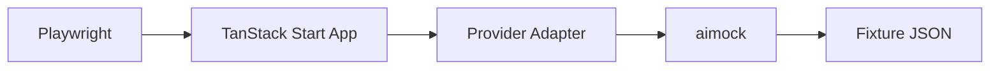

LLM responses are non-deterministic. API calls cost money. And the thing that works perfectly with OpenAI might silently break with Anthropic.

If you've ever built on an AI SDK, you know the feeling: you trust the library works because the README says it supports your provider. But does it? Has anyone actually verified that tool calling works the same way across OpenAI, Gemini, and Ollama? That streaming structured output doesn't break when you switch from Groq to Anthropic?

We got tired of wondering. So we built an E2E testing infrastructure for TanStack AI that verifies every feature across every provider on every pull request. 147 tests. 7 providers. About 2 minutes. Zero API keys required.

Here's how it works and why it matters for the long-term stability of the project.

## The Problem with Testing AI Libraries

Unit tests are great for business logic. They're terrible for verifying that your OpenAI adapter actually produces the same streaming behavior as your Gemini adapter.

The typical approach for AI SDKs is to unit-test the adapter layer with mocked HTTP responses, maybe run a handful of integration tests against a real API in CI, and call it a day. This breaks down in three predictable ways:

**Mocks lie.** When you mock at the HTTP level, you're testing your assumptions about the API, not the API itself. Provider response formats change. Streaming chunk boundaries differ. Edge cases in tool call serialization only surface with real payloads.

**Real API tests are flaky and expensive.** Rate limits, network timeouts, non-deterministic responses, and per-token costs all conspire to make CI unreliable. Most teams end up skipping these tests or running them manually before releases.

**Provider parity is assumed, never verified.** You ship a new feature, test it with OpenAI, and assume the other 6 providers work the same way. They usually do. Until they don't, and a user files a bug report.

TanStack AI's previous smoke-test setup hit all three of these walls. Tests were fragmented across multiple directories, coverage was inconsistent, and there was no way to run the full matrix quickly or deterministically. We needed something better.

## What We Built

The new E2E infrastructure has three components:

1. **A TanStack Start test app** that serves as the harness, with routes for every provider/feature combination
2. **aimock** as a drop-in replacement for real LLM APIs, serving deterministic fixture responses
3. **Playwright** driving the browser with per-test isolation

The flow is straightforward:



Playwright opens the test app, navigates to a route like `/openai/chat`, and interacts with the UI. The app's provider adapter thinks it's talking to OpenAI, but the `baseURL` points at aimock. aimock matches the request against a fixture file and returns a deterministic response.

Every test gets a unique `X-Test-Id` header. This is what makes parallel execution work: aimock uses the header to route each test to its own fixture sequence, so 147 tests can run simultaneously without stepping on each other.

## The Numbers

147 tests cover 17 features across 7 providers. Here's the matrix:

| Category | Tests | Features |
|---|---|---|
| Chat and text | 28 | chat, one-shot-text, multi-turn, structured-output |
| Tool calling | 38 | single, parallel, approval, text-tool-text, agentic-structured |
| Multimodal | 10 | image input, structured multimodal |
| Generation | 20 | summarize, summarize-stream, image-gen, TTS, transcription |
| Reasoning | 3 | OpenAI, Anthropic, Gemini thinking blocks |
| Tools-test page | 29 | client tools, approvals, race conditions, server-client sequences |
| Advanced | 6 | abort, lazy tools, custom events, middleware, error handling |
| Middleware | 3 | onChunk transform, onBeforeToolCall skip, passthrough |

**Providers:** OpenAI, Anthropic, Gemini, Ollama, Groq, Grok, OpenRouter.

Not every provider supports every feature (Ollama doesn't do image generation, for example). The test matrix encodes this: each test checks whether the provider supports the feature and skips gracefully if not. When a provider adds support, you flip a flag in the support matrix and the tests start running automatically.

The full suite completes in about 2 minutes with parallel execution.

## Why This Matters Long-Term

Testing infrastructure isn't exciting. But it's the difference between an SDK you can trust for years and one that breaks in subtle ways every few releases.

**Regressions are caught before they merge.** Every PR runs the full E2E suite. If a change to the streaming parser breaks Anthropic's tool calling, CI goes red before it hits main. No user reports. No hotfix releases.

**New providers slot into the matrix.** Adding a provider means implementing the adapter, adding it to the support matrix, and pointing it at aimock. The existing 17 feature tests run against it automatically. The infrastructure scales with the project.

**Contributors get fast feedback.** A 2-minute test suite that runs without API keys means anyone can fork the repo, make a change, and verify it works across all providers. No secrets to configure, no tokens to burn, no flaky CI to retry.

**The test suite is documentation.** Every fixture file is a concrete example of what TanStack AI expects from a provider. The `chat/basic.json` fixture shows exactly what a chat response looks like. The `tool-calling/single.json` fixture shows the full tool call and response sequence. When behavior is ambiguous, the fixtures are the source of truth.

This is how you build compound stability. Each test guards against a specific regression. Over time, the suite accumulates into a safety net that gets stronger with every contribution.

## How aimock Makes It Work

[aimock](https://github.com/CopilotKit/aimock) is an open-source mock server built by the CopilotKit team. It serves deterministic LLM responses from JSON fixture files. Here's what a fixture looks like:

```json
{
  "fixtures": [
    {
      "match": { "userMessage": "[chat] recommend a guitar" },
      "response": {
        "content": "I'd recommend the Fender Stratocaster for its versatile tone..."
      }
    }
  ]
}
```

For tool calling, fixtures support multi-step sequences:

```json
{
  "fixtures": [
    {
      "match": {
        "userMessage": "[toolcall] what guitars do you have in stock",
        "sequenceIndex": 0
      },
      "response": {
        "toolCalls": [{ "name": "getGuitars", "arguments": "{}" }]
      }
    },
    {
      "match": {
        "userMessage": "[toolcall] what guitars do you have in stock",
        "sequenceIndex": 1
      },
      "response": {
        "content": "Here's what we have in stock: ..."
      }
    }
  ]
}
```

The `sequenceIndex` field lets you model multi-turn tool flows: the LLM calls a tool, gets a result, then responds with text. aimock plays back each step in order.

A single aimock instance starts in `globalSetup` and is shared across all tests. Provider adapters are configured to point at aimock's URL instead of the real API endpoint. The `X-Test-Id` header isolates parallel tests so they don't share fixture state.

aimock also has a recording mode: set a real API key, run the tests, and it captures live responses as fixture files. This makes it easy to add new tests or update existing fixtures when provider behavior changes.

## Try It

The entire E2E suite ships with TanStack AI. Clone the repo and run it:

```bash
pnpm --filter @tanstack/ai-e2e test:e2e
```

No API keys. No setup. 147 tests across 7 providers in about 2 minutes.

If you want to see what's being tested, browse `testing/e2e/fixtures/` for every fixture or `testing/e2e/tests/` for every spec file. It's all open source.
