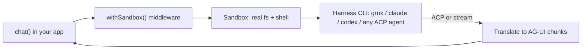

Wiring a coding agent into your own app sounds simple until you actually do it. Then you hit two walls at once: every agent CLI speaks its own protocol, and every one of them wants to run somewhere it can touch a real filesystem and a shell.

So you write a bespoke adapter for Claude Code. A different one for Codex. A third for whatever ships next quarter. And then you still have to answer the scary question: where does this thing run, and what can it reach while it runs?

TanStack AI's new sandbox layer collapses both walls into one pattern. A coding agent runs **inside an isolated sandbox**, and its work streams straight back through the same `chat()` you already use. This post walks through how it fits together, and the part that has no equivalent anywhere else: plugging in *any* agent that speaks the Agent Client Protocol, with no dedicated package.

## The real problem: two moving parts, glued by hand

A "coding agent in your app" is really two independent decisions:

- **Which agent runs** - Claude Code, Codex, OpenCode, Grok Build, or something newer.
- **Where it runs** - your laptop for dev, a container for isolation, a cloud VM or the edge for production.

Most setups hard-couple those two decisions. The agent's SDK assumes a runtime, the runtime assumes an agent, and swapping either one means rewriting the integration. You end up maintaining a matrix of glue you never wanted to own.

The fix is to make both decisions **independent and swappable**, behind one interface. That is exactly what the sandbox layer does.

## One pattern: `chat()` + `withSandbox()`

Here is a complete, runnable shape. An agent clones a repo into a Docker sandbox, fixes a bug, and streams its work back:

```ts
import { chat } from '@tanstack/ai'
import { grokBuildText } from '@tanstack/ai-grok-build'
import {
  createSecrets,
  defineSandbox,
  defineWorkspace,
  githubRepo,
  withSandbox,
} from '@tanstack/ai-sandbox'
import { dockerSandbox } from '@tanstack/ai-sandbox-docker'

const sandbox = defineSandbox({
  id: 'fix-the-bug',
  provider: dockerSandbox({ image: 'node:22' }),
  workspace: defineWorkspace({
    source: githubRepo({ repo: 'owner/app' }),
    setup: ['corepack enable', 'pnpm install'],
    secrets: createSecrets({ XAI_API_KEY: process.env.XAI_API_KEY ?? '' }),
  }),
})

const stream = chat({
  adapter: grokBuildText('grok-build'),
  messages,
  middleware: [withSandbox(sandbox)],
})
```

The harness adapter (`grokBuildText`) declares it needs a sandbox, `withSandbox()` provides one, and the agent's tool calls, file edits, and reasoning come back as the same AG-UI stream chunks any other adapter produces. Your UI does not need to know a coding agent is on the other end.

Everything below is a variation on this one snippet.

## Pick where it runs: the provider axis

The provider owns isolation - *where* the agent actually runs. Every provider implements the same `SandboxHandle` contract, so swapping one is a one-line change to your sandbox definition:

```ts
import { localProcessSandbox } from '@tanstack/ai-sandbox-local-process'
import { dockerSandbox } from '@tanstack/ai-sandbox-docker'
import { daytonaSandbox } from '@tanstack/ai-sandbox-daytona'
import { vercelSandbox } from '@tanstack/ai-sandbox-vercel'

const dev = localProcessSandbox()                 // your machine, fast dev loop
const isolated = dockerSandbox({ image: 'node:22' }) // a real container boundary
const cloud = daytonaSandbox()                    // managed cloud sandbox
const microvm = vercelSandbox({ runtime: 'node24' }) // managed microVM
```

There is also a Cloudflare provider for running the agent and a live preview at the edge. The workspace, secrets, and policy you attach do not change when you swap providers - only the isolation, auth, and snapshot behavior do.

## Pick which agent runs: the harness axis

The harness decides *what* runs. The first-class adapters cover the agents most people reach for:

- `@tanstack/ai-grok-build` - `grokBuildText`
- `@tanstack/ai-claude-code` - `claudeCodeText`
- `@tanstack/ai-codex` - `codexText`
- `@tanstack/ai-opencode` - `opencodeText`

Switching agents is the other one-line change:

```ts
import { claudeCodeText } from '@tanstack/ai-claude-code'

const stream = chat({
  adapter: claudeCodeText('sonnet'),
  messages,
  middleware: [withSandbox(sandbox)],
})
```

Same sandbox, same wiring, different agent. The two axes really are independent.

## The part nobody else has: `acpCompatible`

First-class adapters are great until the agent you want does not have one. This is where most stacks stop and you go back to writing glue.

TanStack AI does not. The [Agent Client Protocol](https://agentclientprotocol.com) (ACP) is a shared JSON-RPC protocol that a growing list of coding agents already speak. `acpCompatible` turns *any* of them into a `chat()` adapter, with no dedicated package. Think of it as the `openaiCompatible` of coding agents.

```ts
import { acpCompatible } from '@tanstack/ai-acp'

const pi = acpCompatible({
  name: 'pi',
  command: ({ model, harnessCwd }) => `pi --acp -m ${model} --cwd ${harnessCwd}`,
})

const stream = chat({
  adapter: pi('pi-fast'),
  messages,
  middleware: [withSandbox(sandbox)],
})
```

That is the whole integration. You describe how to launch the agent's ACP server, and `acpCompatible` handles the session, permissions, tool bridging, and translation into the same AG-UI stream as every other adapter.

The payoff is breadth. The [ACP agents list](https://agentclientprotocol.com/get-started/agents) already includes `gemini --acp`, Cursor, Goose, Cline, OpenHands, Qwen Code, Kimi CLI, Pi, and dozens more. Any of them drops into a sandbox with the snippet above. Like `openaiCompatible`, you can declare typed `models` and per-call `modelOptions` so the whole thing stays type-checked.

## What you get for free

Because every harness runs through the same sandbox layer, capabilities are shared rather than re-implemented per agent:

- **Secrets** - `createSecrets()` injects values into the agent's environment at create time. They are never written to snapshots or the event log.
- **Provisioning** - clone a repo, run setup commands, and project workspace skills (files, instructions, MCP servers) into the harness's native conventions.
- **Streaming** - text, reasoning, and tool activity come back as standard AG-UI chunks, so existing chat UIs render an in-sandbox agent with no changes.
- **Session resume** - thread a session id back through `modelOptions.sessionId` to continue where the agent left off.
- **Guardrails** - permission modes (and `defineSandboxPolicy`) decide what the agent may do without prompting.

## How it fits together



The middleware ensures the sandbox exists, the adapter spawns the agent inside it, and the agent's protocol (ACP for the compatible path, native streams for the first-class ones) is translated back into the chunks your UI already speaks.

## Try it

If you have ever wanted an agent to actually act on a real codebase - clone it, run the tests, edit files, hand back a diff - this is the shortest path there. Pick a provider, pick an agent (or bring your own ACP agent), and drive it with the `chat()` you already know.

Read the [sandbox docs](https://tanstack.com/ai/latest/docs/sandbox/overview) to get an agent fixing a bug in a sandbox on your laptop in a few minutes, then swap the provider when you are ready to ship.

One import. Any agent. Any sandbox.
