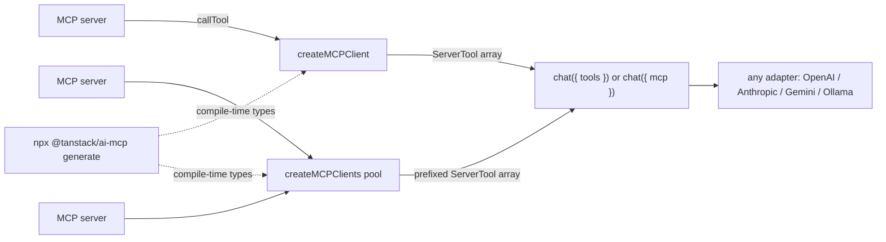

Most "we support MCP now" announcements hand you exactly one way to use it. Connect to a server, get some tools, hope the lifecycle works out.

`@tanstack/ai-mcp` takes the opposite stance. It is a **host-side [Model Context Protocol](https://modelcontextprotocol.io) client** that turns any MCP server into ordinary `ServerTool[]` you spread into `chat()`. Because the output is just tools, every layer above it stays the same: any adapter (OpenAI, Anthropic, Gemini, Ollama), any agent loop, any framework integration. TanStack AI never knows MCP was involved.

That single design decision is what lets you use MCP **your way**: one server or fifty, fully managed or hand-wired, untyped-and-fast or generated-and-strict. This post walks the entire surface, every flag and every config, with the exact types from the package.

Built on the official `@modelcontextprotocol/sdk`, the runtime stays edge-deployable. The Streamable HTTP transport is `node:`-free, the Node-only stdio transport is isolated behind a subpath, and the codegen CLI's heavy dependencies are bundled into the bin only, never into the library you ship.

## The mental model

There is exactly one idea to internalize:

> An MCP client is a tool factory. You get back `ServerTool[]`. You spread them into `chat({ tools })`.

```ts
import { chat } from '@tanstack/ai'
import { openaiText } from '@tanstack/ai-openai/adapters'
import { createMCPClient } from '@tanstack/ai-mcp'

const mcp = await createMCPClient({
  transport: { type: 'http', url: process.env.MCP_URL! },
})

const stream = chat({
  adapter: openaiText('gpt-5.5'),
  messages,
  tools: await mcp.tools(),
})

await mcp.close()
```

Everything else in this post is a variation on that line: how you build the client, how you type the tools, how many servers you fan in, and who owns `close()`.



> MCP tool execution is **server-side only**. `createMCPClient` lives in a server route or serverless function, never in browser code.

## Standalone clients: `createMCPClient`

A single client connects to a single server. The options are small and every field is load-bearing.

```ts
interface MCPClientOptions {
  transport: TransportInput // config object or a raw SDK Transport
  prefix?: string // tool-name prefix, e.g. 'github' -> 'github_search'
  name?: string // client identity sent to the server (default 'tanstack-ai-mcp')
  version?: string // client version (default '0.0.1')
}
```

- **`transport`** is the only required field. It is either one of the built-in config objects below or a ready-made SDK `Transport` instance.
- **`prefix`** rewrites every discovered tool name to `${prefix}_${name}`. Use it when one server's tool names might collide with another's. (Pools set this for you - see below.)
- **`name`** and **`version`** are the client identity reported to the server during the MCP handshake.

The returned `MCPClient` exposes the full protocol surface:

```ts
interface MCPClient {
  readonly capabilities: Record<string, unknown> // server capabilities from the handshake
  tools(options?): Promise<ServerTool[]> // discovery (overloaded, see below)
  resources(): Promise<Resource[]>
  readResource(uri: string): Promise<ReadResourceResult>
  resourceTemplates(): Promise<ResourceTemplate[]>
  prompts(): Promise<Prompt[]>
  getPrompt(name, args?): Promise<GetPromptResult>
  close(): Promise<void>
  [Symbol.asyncDispose](): Promise<void> // for `await using`
}
```

### Transports

Four ways to connect, one consistent shape.

**HTTP (Streamable HTTP)** is the preferred transport for remote servers and the only one that is fully edge-safe.

```ts
const mcp = await createMCPClient({
  transport: {
    type: 'http',
    url: 'https://my-mcp-server.example.com/mcp',
    headers: { Authorization: `Bearer ${process.env.MCP_TOKEN}` },
    fetch: customFetch, // optional: bring your own fetch
    authProvider: myOAuth, // optional: OAuth 2.1 (see Authentication)
  },
})
```

**SSE** is for servers that still implement the legacy Server-Sent Events transport. Same fields as HTTP (`url`, `headers?`, `fetch?`, `authProvider?`).

```ts
const mcp = await createMCPClient({
  transport: { type: 'sse', url: 'https://example.com/sse' },
})
```

**stdio** spawns a local MCP process. Because it imports Node-native modules, it is isolated behind the `@tanstack/ai-mcp/stdio` subpath so your edge bundles stay clean.

```ts
import { stdioTransport } from '@tanstack/ai-mcp/stdio'
import { createMCPClient } from '@tanstack/ai-mcp'

const mcp = await createMCPClient({
  transport: stdioTransport({
    command: 'node',
    args: ['./my-mcp-server.js'],
    env: { API_KEY: process.env.API_KEY ?? '' },
    cwd: process.cwd(), // optional
  }),
})
```

Passing a `{ type: 'stdio' }` config object to `createMCPClient` directly throws on purpose, with a message pointing you at the subpath. That keeps the Node-only code path out of edge builds unless you opt in.

**Custom transport** is the escape hatch: pass any SDK `Transport` instance straight through. `InMemoryTransport` is re-exported for in-process testing.

```ts
import { createMCPClient, InMemoryTransport } from '@tanstack/ai-mcp'

const [clientTransport] = InMemoryTransport.createLinkedPair()
const mcp = await createMCPClient({ transport: clientTransport })
```

This escape hatch is also how you handle interactive OAuth redirect flows: build a `StreamableHTTPClientTransport` yourself, keep a reference so you can call `transport.finishAuth(code)` in your callback route, then hand it to `createMCPClient({ transport })`.

### Authentication

Two paths, both passed on the `http`/`sse` transport config.

- **Static tokens**: set `headers` and they are sent with every request.
- **OAuth 2.1**: set `authProvider` to any `OAuthClientProvider` from `@modelcontextprotocol/sdk/client/auth.js`. The SDK transport then attaches tokens, refreshes them, and retries on 401 with no extra wiring on the TanStack side.

```ts
import type { OAuthClientProvider } from '@modelcontextprotocol/sdk/client/auth.js'

declare const myOAuthProvider: OAuthClientProvider

const mcp = await createMCPClient({
  transport: {
    type: 'http',
    url: 'https://my-mcp-server.example.com/mcp',
    authProvider: myOAuthProvider,
  },
})
```

## Three modes of type safety

This is where "your way" gets literal. The same client supports three levels of typing, and you pick per call site.

### Mode 1 - Auto-discovery: `client.tools()`

Call `tools()` with no arguments to get every tool the server exposes. No setup. Tool arguments are `unknown` at compile time and validated at runtime against the server's JSON Schema.

```ts
const tools = await mcp.tools()
// tools: ServerTool[] - names known, args typed `unknown`
```

Two behaviors worth knowing:

- **Task-based tools are skipped.** A tool that declares `execution.taskSupport: 'required'` can only run through the SDK's experimental task flow, which plain `callTool` cannot satisfy (the server rejects it with `-32600`). Discovery filters these out so the model is never offered a tool that cannot succeed.
- **Structured output is preserved.** When a tool declares an `outputSchema`, the client returns the server's `structuredContent` so your existing output validation runs against the typed payload instead of a JSON-in-text blob.

### Mode 2 - Explicit definitions: `client.tools([...defs])`

Pass TanStack `toolDefinition()` instances to get full TypeScript types and Zod validation. This is an **allowlist**: only the named tools come back.

```ts
import { toolDefinition } from '@tanstack/ai'
import { z } from 'zod'

const searchDef = toolDefinition({
  name: 'search',
  description: 'Search for items',
  inputSchema: z.object({ query: z.string() }),
  outputSchema: z.array(z.object({ id: z.string(), title: z.string() })),
})

const tools = await mcp.tools([searchDef])
// tools[0].execute is typed: (args: { query: string }) => ...
```

Two errors guard this path:

- `MCPToolNotFoundError` if a definition's name is not on the server.
- `MCPTaskRequiredToolError` if you explicitly bind a task-required tool (which discovery would have silently skipped).

This mode reuses the existing `toolDefinition()` primitive. There is no parallel schema system to learn, and the per-tuple return type is preserved so each tool keeps its own input/output types.

### Mode 3 - Generated types: `createMCPClient<GeneratedServer>`

Run the codegen CLI against a live server to emit per-server `interface` types, then pass the type as a generic. Tool names narrow to the server's literal names, so a typo becomes a compile error, with zero runtime cost.

```ts
import type { GithubServer } from './mcp-types.generated'

const mcp = await createMCPClient<GithubServer>({
  transport: { type: 'http', url: process.env.GITHUB_MCP_URL! },
})

const tools = await mcp.tools()
// each tool name is narrowed from GithubServer['tools']
```

Mode 3 types the tool _names_; tool _arguments_ stay untyped on the discovery path. Combine it with Mode 2 when you want both narrowed names and typed args. The full CLI workflow is in its own section below.

## Resources and prompts

MCP servers expose more than tools. The client surfaces resources and prompts directly, plus two converters that turn them into shapes `chat()` understands.

```ts
const resources = await mcp.resources()
const file = await mcp.readResource('file:///readme.md')
const templates = await mcp.resourceTemplates()

const prompts = await mcp.prompts()
const review = await mcp.getPrompt('code-review', { language: 'ts' })
```

To seed a conversation with that content, use the converters:

```ts
import { mcpResourceToContentPart, mcpPromptToMessages } from '@tanstack/ai-mcp'

// fetch a resource and a prompt from the server
const file = await mcp.readResource('file:///readme.md')
const review = await mcp.getPrompt('code-review', { language: 'ts' })

// resource content block -> ContentPart (text, with a sensible fallback for blobs)
const readmePart = mcpResourceToContentPart(file.contents[0])

// MCP prompt -> ModelMessage[] you can prepend to chat({ messages })
const seeded = mcpPromptToMessages(review)

const stream = chat({
  adapter: openaiText('gpt-5.5'),
  messages: [{ role: 'user', content: [readmePart] }, ...seeded, ...messages],
  tools: await mcp.tools(),
})
```

`mcpResourceToContentPart` maps a `text` field to a text part, a `blob` field to a `[binary resource <uri>]` placeholder, and anything else to stringified JSON. `mcpPromptToMessages` normalizes each message to a `user`/`assistant` role with text content.

## Lifecycle and cancellation

A standalone client is **caller-owned**. `chat()` never closes a client you spread manually, which is what makes warm reuse across requests possible.

```ts
// caller owns close()
const mcp = await createMCPClient({ transport })
try {
  const stream = chat({
    adapter: openaiText('gpt-5.5'),
    messages,
    tools: await mcp.tools(),
  })
  return toServerSentEventsResponse(stream)
} finally {
  // careful: see the streaming note below
}
```

Tools execute **lazily while the response stream is consumed**, so the client must stay open until the stream is fully drained. In a route handler that returns a streaming `Response`, a `try/finally` around the `return` closes the client before the body streams and in-flight tool calls fail. Close in a middleware terminal hook (`onFinish`/`onAbort`/`onError`, exactly one fires per run) instead, or let the managed `mcp` option handle it.

For scoped usage, the client implements `Symbol.asyncDispose`:

```ts
await using mcp = await createMCPClient({ transport })
// closed automatically at end of scope
```

### Cancellation threads through tool execution

The core `@tanstack/ai` package gained an optional `abortSignal` on `ToolExecutionContext`, and `chat()` threads the run's signal (the caller's `AbortController` combined with any middleware `abort()`) into every tool execution.

`@tanstack/ai-mcp` forwards that signal straight into the SDK's `callTool`:

```ts
// inside the generated execute body
ctx?.abortSignal?.throwIfAborted()
const result = await client.callTool(
  { name, arguments: args ?? {} },
  undefined,
  { signal: ctx?.abortSignal },
)
```

The practical effect: when a chat run is aborted, a long-running MCP `callTool` is cancelled with it instead of running to completion in the background. The change is additive and backward-compatible.

## Pools: `createMCPClients`

One server is the simple case. Real agents pull tools from several. `createMCPClients` connects to many servers in parallel and merges their tools into one flat array.

```ts
import { createMCPClients } from '@tanstack/ai-mcp'

const pool = await createMCPClients({
  github: { transport: { type: 'http', url: process.env.GITHUB_MCP_URL! } },
  linear: { transport: { type: 'http', url: process.env.LINEAR_MCP_URL! } },
})

// tools: [github_search_repos, github_create_issue, linear_create_issue, ...]
const tools = await pool.tools()
```

The config is a `Record<string, MCPClientOptions>` - the same options as a single client, keyed by a name you choose. The pool gives you:

- **Parallel connect with safe cleanup.** All servers connect via `Promise.allSettled`. If any one fails, the already-connected clients are closed before a single `MCPConnectionError` is thrown. No dangling connections.
- **Auto-prefixing.** Each server's tools are prefixed with its config key by default, so `github` tools become `github_*`. This is collision-free out of the box.
- **Per-server access.** `pool.clients.github` is a full `MCPClient`, so you can reach one server's resources, prompts, or typed-definition tools.
- **A merged `tools()`.** It collects every server's tools, settles failures so a broken server is reported by its config key rather than an unattributed SDK error, and throws `DuplicateToolNameError` if two names still collide after prefixing.
- **`close()` and `await using`.**

```ts
const linearTools = await pool.clients.linear.tools()
const repoReadme = await pool.clients.github.readResource('repo://readme')
```

### Controlling the prefix

The default prefix is the config key. Override it with a string, or disable it entirely with an empty string.

```ts
const pool = await createMCPClients({
  github: {
    transport: { type: 'http', url: process.env.GITHUB_MCP_URL! },
    prefix: 'gh', // -> gh_search_repos
  },
  internal: {
    transport: { type: 'http', url: process.env.INTERNAL_MCP_URL! },
    prefix: '', // no prefix at all
  },
})

await pool.close()
// or: await using pool = await createMCPClients({ ... })
```

A pool satisfies the same structural contract as a single client (`tools()` plus `close()`), so anywhere a client works, a pool works too - including the managed `mcp` option next.

## Managed MCP with `chat({ mcp })`

Spreading tools manually gives you full control. Most of the time you do not want that control, you want the tools discovered and the connections closed for you. That is the `mcp` option, and it is the shortest path to a working integration.

```ts
const mcp = await createMCPClient({
  transport: { type: 'http', url: process.env.MCP_URL! },
})

const stream = chat({
  adapter: openaiText('gpt-5.5'),
  messages,
  mcp: { clients: [mcp] }, // chat() discovers the tools AND closes the client
})

return toServerSentEventsResponse(stream)
```

Here is every field on the option, with exact semantics.

```ts
interface ChatMCPOptions {
  clients: Array<MCPToolSource> // clients and/or pools
  connection?: 'close' | 'keep-alive' // default 'close'
  lazyTools?: boolean // default false
  onDiscoveryError?: (
    error: unknown,
    source: MCPToolSource,
  ) => void | Promise<void>
}
```

### `clients`

An array of anything that satisfies `MCPToolSource`, which is the structural shape `{ tools(options?), close() }`. Both `MCPClient` and `MCPClients` (a pool) match by shape, so you can mix single clients and pools in one array. The core `@tanstack/ai` package does not import `@tanstack/ai-mcp` - the dependency only points one way.

Discovered tools are appended to any tools you already passed via `tools`, so `mcp` and a hand-written `tools` array compose cleanly.

### `connection`

Controls what happens to the connections when the run ends.

- **`'close'` (default)**: `chat()` closes each source after the agent loop completes and the stream is drained. Tools still execute throughout the run; the close happens last. This is the zero-lifecycle-code path.
- **`'keep-alive'`**: `chat()` never closes the connections. You own them, which is exactly what you want for clients you keep warm across requests.

```ts
// warm pool reused across many requests
const pool = await createMCPClients({
  github: { transport: gh },
  linear: { transport: ln },
})

function handler(messages) {
  return chat({
    adapter: openaiText('gpt-5.5'),
    messages,
    mcp: { clients: [pool], connection: 'keep-alive' }, // pool outlives the run
  })
}
```

### `lazyTools`

When `true`, `chat()` calls each source's `tools({ lazy: true })`, which marks the tools `lazy` so their schemas are deferred. Useful when a server exposes a large catalog and you do not want to pay the full schema cost up front. Defaults to `false`.

### `onDiscoveryError`

Called when discovery fails for a single source, with the error and the source that produced it.

- **Throw or rethrow** from the handler to fail the entire chat call fast.
- **Return normally** to skip that source and continue with the rest.
- **Omit the handler** to rethrow by default (fail-fast).

Async handlers are awaited, so a rejected promise also fails fast.

```ts
mcp: {
  clients: [primary, flaky],
  onDiscoveryError(error, source) {
    metrics.increment('mcp.discovery_error')
    // returning (not throwing) => skip this source, keep the others
  },
}
```

### What discovery actually does

When `chat({ mcp })` runs, an internal `MCPManager` is built from the option (and is an inert no-op when `mcp` is undefined, so there is no branching cost otherwise). On each run it:

1. Calls `tools({ lazy })` on every source in parallel.
2. Routes per-source failures through `onDiscoveryError` (or rethrows).
3. Merges all tools and throws `MCPDuplicateToolNameError` if two names collide. The error message tells you to set a `prefix` or use a pool.
4. Runs the chat, then in a `finally` calls `dispose()`, which closes sources only when the policy is `'close'`.

If discovery itself throws, the manager disposes any connected sources first (when the policy is `'close'`) so a failed run does not leak connections.

## The codegen CLI and how it plays with everything

Modes 1 and 2 need no build step. Mode 3 does, and the CLI is how you get there. It introspects live servers and emits compile-time-only types that slot into both standalone clients and pools.

### 1. Declare servers in `mcp.config.ts`

```ts
import { defineConfig } from '@tanstack/ai-mcp'

export default defineConfig({
  servers: {
    github: {
      transport: { type: 'http', url: 'https://github-mcp.example.com/mcp' },
    },
    linear: {
      transport: { type: 'http', url: 'https://linear-mcp.example.com/mcp' },
      prefix: 'linear', // must match the runtime createMCPClient({ prefix })
    },
  },
  outFile: './mcp-types.generated.ts',
})
```

`defineConfig` is purely for editor autocomplete and type checking of the config itself. Each `CodegenServerConfig` carries a `transport` and an optional `prefix`. That `prefix` must match whatever you pass at runtime, because it changes the tool names the types describe.

### 2. Generate

```bash
npx @tanstack/ai-mcp generate
```

The CLI connects to each declared server, introspects its tools, resources, and prompts, and writes the result to `outFile`. Its heavier dependencies are bundled into the bin only, so they never reach the library you deploy.

### 3. The output

One interface per server (extending `ServerDescriptor`) plus a combined pool map:

```ts
// AUTO-GENERATED by `npx @tanstack/ai-mcp generate`. Do not edit.
import type { ServerDescriptor } from '@tanstack/ai-mcp'

export interface GithubServer extends ServerDescriptor {
  tools: {
    search_repositories: {
      input: { query: string; limit?: number }
      output: unknown
    }
    create_issue: {
      input: { repo: string; title: string; body?: string }
      output: unknown
    }
  }
  resources: {}
  prompts: {}
  capabilities: { tools: {} } & Record<string, unknown>
}

export interface MCPServers extends Record<string, ServerDescriptor> {
  github: GithubServer
  linear: LinearServer
}
```

### 4. Wire the types in

For a single client, pass the per-server interface:

```ts
import type { GithubServer } from './mcp-types.generated'

const mcp = await createMCPClient<GithubServer>({
  transport: { type: 'http', url: process.env.GITHUB_MCP_URL! },
})
```

For a pool, pass the combined `MCPServers` map. This is the part that makes codegen and pools click together: the generated map **constrains the pool config keys**, so a missing or misspelled server key is a compile error, and each `pool.clients[key]` is typed to that server's descriptor.

```ts
import type { MCPServers } from './mcp-types.generated'

const pool = await createMCPClients<MCPServers>({
  github: { transport: { type: 'http', url: process.env.GITHUB_MCP_URL! } },
  linear: {
    transport: { type: 'http', url: process.env.LINEAR_MCP_URL! },
    prefix: 'linear', // matches the config; keeps generated names accurate
  },
})

const tools = await pool.tools() // typed, then hand to chat({ mcp })
```

The types are a compile-time overlay. At runtime the pool builds the same descriptor-agnostic clients it always would, which is why the generated map costs nothing in your bundle and nothing at execution time.

## Putting it together

The three concepts compose into one summary: a single server, a pool, and generated types all feed the same `chat()`.

```ts
import { chat, toServerSentEventsResponse } from '@tanstack/ai'
import { openaiText } from '@tanstack/ai-openai/adapters'
import { createMCPClient, createMCPClients } from '@tanstack/ai-mcp'
import type { MCPServers } from './mcp-types.generated'

// one server, managed lifecycle
const single = await createMCPClient({
  transport: { type: 'http', url: oneUrl },
})

// many servers, typed pool, kept warm
const pool = await createMCPClients<MCPServers>({
  github: { transport: { type: 'http', url: process.env.GITHUB_MCP_URL! } },
  linear: {
    transport: { type: 'http', url: process.env.LINEAR_MCP_URL! },
    prefix: 'linear',
  },
})

const stream = chat({
  adapter: openaiText('gpt-5.5'),
  messages,
  mcp: {
    clients: [single, pool],
    connection: 'keep-alive', // you own `pool`; close it on shutdown
    lazyTools: true,
    onDiscoveryError: (err, source) => log.warn('mcp discovery failed', err),
  },
})

return toServerSentEventsResponse(stream)
```

One server or many. Managed or manual. Untyped or generated. Warm or closed. Same `chat()`, every time.

## Why the architecture matters

A few decisions are worth calling out because they affect where you can deploy:

- **Edge-safe by default.** Streamable HTTP has no `node:` imports, so the common path runs on edge runtimes. The Node-only stdio transport is quarantined behind `@tanstack/ai-mcp/stdio` and only loads if you import it.
- **No new tool primitive.** Typed tools reuse `toolDefinition()`. The package adds a client, a pool, converters, and a CLI - not a parallel schema system.
- **Additive core change.** The only change to `@tanstack/ai` is an optional `abortSignal` on `ToolExecutionContext`, threaded through tool execution. Existing code keeps working; long-running tools gain cancellation.

## Get started

Install the package:

```bash
pnpm add @tanstack/ai-mcp
```

That is all you need - `@modelcontextprotocol/sdk` ships as a dependency, so it comes along automatically. Add it to your own `package.json` only if you import from it directly (for example the `OAuthClientProvider` type or a hand-built `StreamableHTTPClientTransport` in the escape-hatch path).

Then connect a server, hand it to `chat()`, and ship. Read the full guides at [tanstack.com/ai](https://tanstack.com/ai): start with the MCP overview, then the managed `chat()` integration, the manual typed-tools path, and the codegen workflow.

Whatever shape your MCP setup takes - one server or a fleet, fully managed or hand-wired, loosely typed or generated end-to-end - `@tanstack/ai-mcp` meets you there. It is your MCP, your way.
